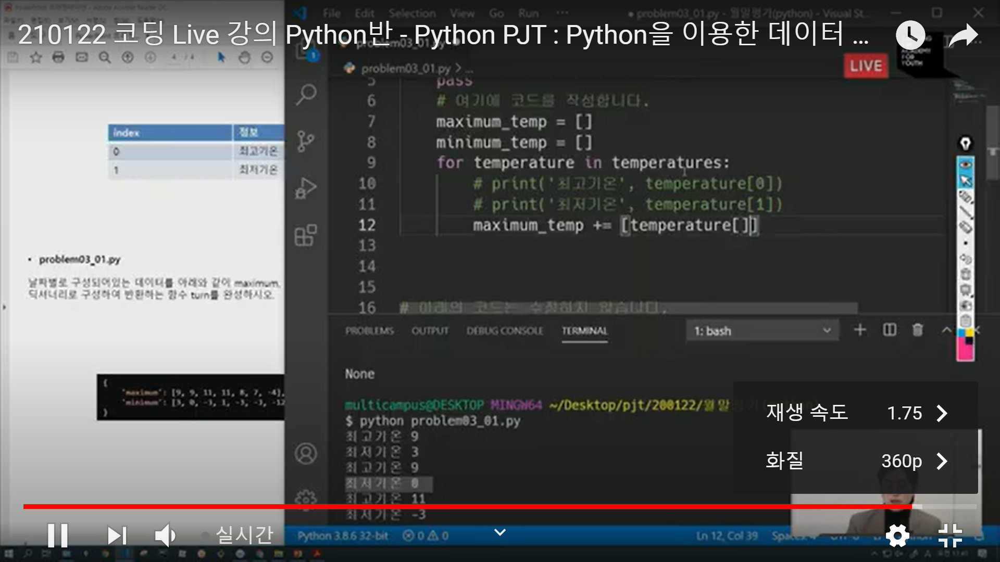
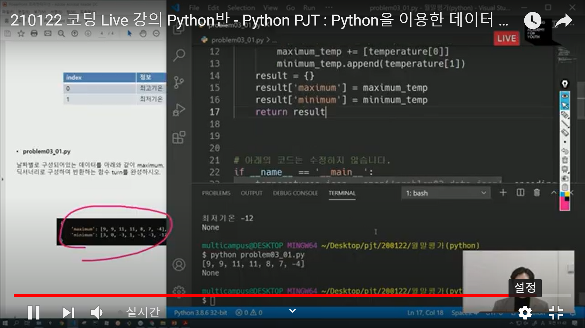

파일을 열자

데이터 폴더 안에 들어있는  제이슨 파일을 여는 코드 작성해보자!

open(파일이름, 모드, ....) 이렇게 open 키워드를 이요하여 파일을 열어줌

이렇게 하는 방법은 python doct에 다 나와있다.

특히 파일을 열고 닫는 행위는 IO에 해당하기 때문에

python file io이렇게 구글링하면 된다.

제이슨파일을 파이썬에서 쓸 수 있도록 딕셔너리 형태로 열자 !

우리가 가지고있는 파일의 형태는 제이슨이다. 

제이슨은 딕셔너리 형태를 가지고 있긴 하지만 엄연히 다른 확장자기 때문에 

특별한 키워드가 필요하다.

load!

VS Code에서 open 키워드로 파일을 열고 load로 JSON파일을 읽어들이려 했지만

인코딩 문제 발생. 

이유는 보통 윈도우에서 쓰는 코덱이 적용되서 그럼.

open할 때 괄호 안의 파일명 오른쪽에 encoding=utf-8 넣어주면 됨!

open(파일이름, encoding=utf-8 )

이제 파일이 열리긴 하는데 가독성이 좋지 않게 출력이 됨.

pprint 이용해서 이쁘게 보자!

자 이제 해당 결과값에서 원하는 정보만을 뽑아와야지.

키로 접근하는 방법 1 대괄호를 적용하는 방법 : music_dict['singer']

키로 접근하는 방법 2 .get 적용하는 방법 : music_dict.get('album')

차이점?

만약 안에 데이터가 없다면 대괄호로 적용했을땐 에러발생.

.get으로 적용했으면 none값 반환해줌 

==>> 이를 bool으로 이용해 코드를 짤 수 있다. 강사님은 .get을 추천

이제 함수를 짜보자.

결과값 반환을 위한 딕셔너리 함수!

def music_Info(music_dict):

​    pass

music_Info(music_dict) //==>>위 함수를 부름.

그러나 def안의 ()에 다른 단어를 적어도 되긴 함.

def music_Info(a):

​    pass

music_Info(music_dict) 

이렇게도 가능

이 의미는 해당함수 내에서는 a로 불리운다 라는 것.

그러나 웬만하면 통일시켜 주자!

그 다음으로, 새로운 딕셔너리에 내가 원하는 정보만을 넣자 result!

def music_Info(music_dict):

​    result={}

​    singer = music_dict['singer']

​    title = music_dict.get('title')

​	result['singer'] = singer //==>>['singer'] 의 이름도 바꿀순 있다. 우리가 새로만든 딕셔너리니까

​	result['title'] = title

​	print(result) //==>>  확인해보자

music_Info(music_dict)

return result!

함수에 대한 결과값으로 반환(return)해야 해당함수가끝났다는 표시와함께 출력이 된다!

그래야music_Info(music_dict)를 실행시킨거임..!

중간정리!!

이전의 제이슨에는 너무 많은 데이터가 있었음

우리는 우리가 필요한 데이터인 두 개의 데이터를 추출해낸걸 확인할수있다

휴식 후 다음 수업!

여러개의 데이터에선 어떻게 할 수 있을까

---

[팁]

코드를 짤 때 주석을 최대한 많이 달자.

추후에 내가 작성한 코드를 제대로 기억하기 위해서.

import는 최상단에 끌어올리자.

music.json 파일 : 제이슨파일이지만 딕셔너리 타입

원하는 정보만 가지고 오고싶다?

딕셔너리가 여러개 묶여있는 리스트 상태에서는 어떻게 해야할까

for문

git init다음 항상 파일 2개 생성해라

하나는 리드미 파일, 하나는 깃 이그노어.(필요없는 파일이 섞일 가능성이있는것들 관리.)

touch .gitignore ==>> 커멘드랑 인터페이스 CLI 환경에서  파일을 생성가능.

파일이름을 적자마자 해당 파일이 추적불가능하게 만들어진다.

내가 깃으로 관리안하니까 추적안했으면 좋겠다는 파일을 모아둠.

깃은 삭제가 일어나더라도 추적이되어서 애초에 내가 관리안할 파일은 에드을 안해야 한다. 

이그노어 폴더에 넣어야 한다.

*.txt 이면 모든 텍스트 사용안하겠단 말임

gitignore.io 홈페이지

python, visualstudiocode, windows를 생성하고

전체결과복사해서 .gitignore파일에 붙여넣기

이제 리드미 만들자 

touch README.md

리드미 : 나좀읽어줘

설명서. 나중에 내가 보았을 때 보기좋으려는 이유

어떤걸 배웟다느걸 설명하기 위한 문서

프로젝트를 만들면서 힘들었던 부분들을 적어도 좋고 에러났던것들 적어도 좋음

블로그형식처럼 적어도됨

git add .  해주자

. 이란..? 숨김처리가 되어있다는 것

ls는 현재 폴더에 있는것ㄱ들 ㅂ ㅗㄹ 수 있음

 ls -a 는 못보았던 친구들이 보이는데..

. 이란..? 숨김처리가 되어있다는 것

. 현재내폴더

.. 상위폴더

깃에서는 .이 현재폴더 그리고 하위폴더까지를 의미함

git status

git commit -m

* 월말평가

practice, hws

기본적으로 함수만드는 문제들..함수선언하는거

함수선언구조!!

if문 for문

함수는 반드시 리턴해야줘야함

공지사항 다시확인하기

