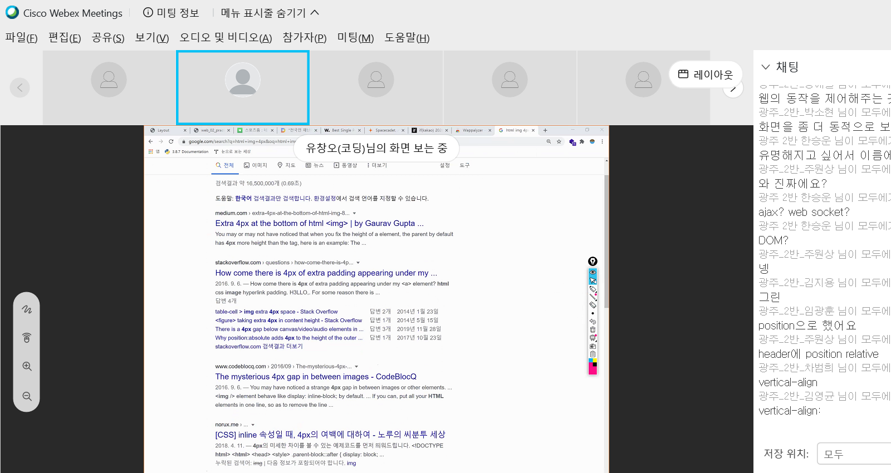

# 사피에서 무엇을 왜 공부하나요?

웹이건 앱이건 간에 하나의 소프트웨어를 첨부터 끝까지 직접 만들어보며 개발 전반적인 내용을 학습해보는 것임.

**Phase 1**

1. python : 비교적 고수준 언어. 배우기가 비교적 편함. 빨리 배워서 빨리 써먹을 수 있고 산업 전반적으로 많이 사용된다. 머신러닝, 빅데이터, 업무 자동화 등... 알고리즘 할 때도 훨씬 편함. 알고리즘 테스트 용을 위해 일부러 파이썬을 배우는 경우도 있음. 

2. html/css, bootstrap : 내일부턴 bootsrap툴을 배울 것임. css를 간편히 사용할 수 있는 툴. 하나의 정갈한 html페이지를 만드는 법을 배울 것임.
3. Django(+DB) : 웹 프레임워크. 데이터 베이스 개념도 배울 것임. 

**Phase 2**

1. JavsScript : 백엔드도 웹개발을 한다면 백엔드 프론트를 가리지 않고 얘랑은 절대 멀어질 수 없다. 브라우저를 동작시킬 수 있는 유일한 언어기 때문에. html통해 뼈대 만들고 css로 예쁘게 만들어주고 나면 얘네들을 움직이게 해준다. 페이지를 전체 새로고침 하지 않아도 일부만 정보를 계속 받아와줄 수 있는 동작도 만들어줌. (비밀번호 오류를 비밀번호 조그만 창에서 즉각적으로 보여줌)

2. Vue.js (React.js : 페북그룹이 만든 것): 백엔드와 프론트 엔드 코드를 명확하게 분리해준다. Vue.js를 이용하면 다른 메뉴, 다른 주소로 들어가도 새로고침이 발생하지 않는 것을 만들 수 있다. 정식명칭은 SPA 어플리케이션이라고 한다. 

   

   **[참고] Wappalyzer**

   Wappalyzer를 구글 웹스토에서 추가해주면 특정 사이트가 어떤 기술로 개발되었는지 확인할 수 있다.

이미지 태그는 기본적으로 인라인 요소.

.card-img에 vertical-align : bottom

제주도 서귀포시 성산읍 2023.03.23

h4와 p는 block이라 한줄을 다 차지해서 따로따로 출력되는 것임.

둘 다 in line으로 바꿔주면 됨

Css dinner : 선택자를 통해 꾸미는 것을 연습할 수 있음.