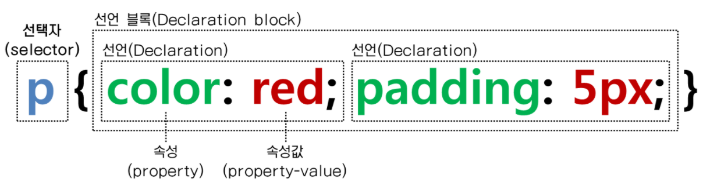
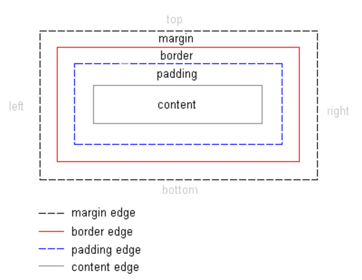
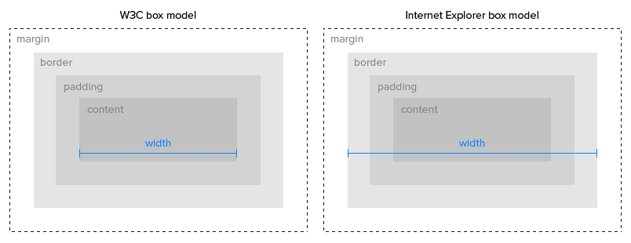
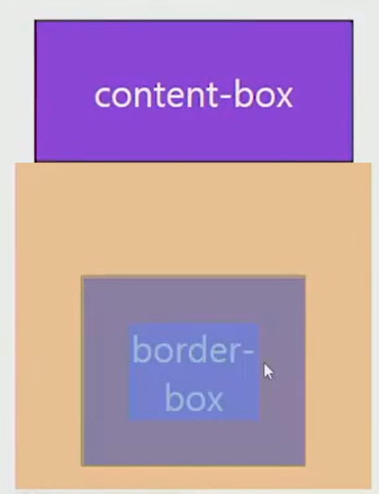

[TOC]

# CSS

> 스타일, 레이아웃 등을 통해 HTML이 사용자에게 어떻게 표시 되는지를 지정하는 언어
>
> 사용자에게 문서(HTML)를 표시하는 방법을 지정하는 언어

<br>

## CSS 구문

- 구문은 **선택자**와 함께 열린다. (스타일을 지정할 html 요소를 선택. )
- 다음 중괄호가 있는데 이 안에는 속성과 값 쌍 형태를 가지는 하나 또는 그 이상의 선언(declaration)이 있다. 
- 각 쌍은 우리가 선택한 요소의 속성을 지정하고 속성에 부여할 값을 지정한다.




<br>

**선언문** 

- **속성** (Property)
  - 사람이 읽을 수 있는 식별자로, 어떤 (글꼴, 너비, 배경색 등) 스타일 기능을 변경할지 나타냅니다.
- **값** (Value)
  - 각 속성에는 값을 부여한다.
  - 값은 어떻게 (글꼴을 이걸로, 배경 색을 저걸로 등)스타일 기능을 변경할 건지 나타낸다.

<br>

**CSS 정의 방법**

1. `Inline style`

   html 코드를 스타일링 한다

```html
<!DOCTYPE html>
<html lang="en">
<head>
  <meta charset="UTF-8">
  <meta name="viewport" content="width=device-width, initial-scale=1.0">
  <title>Document</title>
</head>
<body>
  <h1 style="color:blue; font-size: 100px;">Hello</h1> <!-- Inline style-->
</body>
</html>
```


2. 내부 참조 (`Embedding style`)

   head 태그 내에 `<style>`에 지정

```html
   <!DOCTYPE html>
   <html lang="en">
   <head>
     <meta charset="UTF-8">
     <meta name="viewport" content="width=device-width, initial-scale=1.0">
     <title>Document</title>
     <style> /* 내부참조 방법 */
   h1 { /* h1 태그에 대한 스타일 속성값 지정해줌 */
       color: blue;
       font-size: 100px;
   }
   </style>
   </head>
   <body>
   </body>
   <html>
```

   

3. 외부 참조 (`Link style`)

   html이 외부에 있는 css파일을 불러오는 것

   html파일의 `<head>` 내 `<link>`태그를 통해  css를 불러온다.


​	외부참조 방법은 보통 세 개의 html에 공통적으로 적용하고 싶은 폰트 사이즈나 폰트 스타일을 

​	css코드에 중복되지 않도록 만들어주기 위해 **중복되는 부분만 따로 css 파일에 뽑아내어** 

​	**관리**해주는 것으로 많이 사용되고 있다.


```css
   /* 외부 css파일 */
   
   h1 {
       color: blue;
       font-size: 20px
   }
```

   ```html
   <!--html파일-->
   
   <!DOCTYPE html>
   <html lang="en">
   <head>
    <title>Document</title>
     <link rel="stylesheet" href="mystyle.css"> <!--외부참조--><!--href : 참조파일 경로를 기재하는 곳-->
   </head>
   <body>
     <h1>This is my site</h1>
   </body>
   </html>
   ```

   `<link>`태그의 rel속성은 반드시 명시되어야 하는 필수 속성입니다.

​	`<link rel="속성값">`


​	이 속성값은 여러가지가 있는데 그 중 `stylesheet` 속성값은 

​	스타일 시트(stylesheet )로 사용할 외부 리소스를 불러올 때 사용합니다.

​	`href="참조파일 경로"`

<br>

---

<br>

## CSS Selector

> 선택자는 스타일을 지정할 웹 페이지의 HTML 요소를 대상으로 하는 데 사용

### 기본 선택자

1. 전체 선택자 (*),

2. 요소 선택자(h1, p, a 태그 등..)


3. **클래스(class) 선택자** (웬만하면 대부분 클래스 선택자를 사용)

- 클래스 선택자는 마침표(.) 문자로 시작 하며 **해당 클래스가 적용된 문서의 모든 항목을 선택**
- 하나의 클래스를 만든 후 해당 클래스 하위 문서에 재사용이 가능하다. 
  - . green {} 만들어 놓고 p태그 안에 <p class="green" ~~>와 같이!

<br>

4. **아이디(id) 선택자**

- 아이디 선택자는 `#` 문자로 시작하며 기본적으로 **클래스 선택자와 같은 방식으로 사용**
- 그러나 **아이디는 문서 당 한 번만 사용**할 수 있으며 **요소에는 단일 id값만 적용 할 수 있다**
  - 클래스와 가장 크게 다른점! 클래스는 몇 번이고 다른 곳에 적용 가능
- 문서에서 동일한 아이디를 여러 번 사용해도 동작하나 그건 한 번만 사용하자는 암묵적인 약속을 깨는 것이다.

<br>

### **결합자**(combinators)

- **자손** 결합자
  - 셀렉터A  ` `(공백) 셀렉터B
  - 셀렉터A의 **모든 후손** **요소(level n) 중** 셀렉터B와 일치하는 요소 선택
- **자식** 결합자
  - 셀렉터A `>` 셀렉터B
  - 셀렉터A의 **모든 자식 요소(level 1) 중** 셀렉터B와 일치하는 요소 선택

<br>

### **적용 우선순위**

1. `!important`
   - 다른 사람들의 코드에서 발견할 때 그 의미를 알 수 있는 것은 좋다.
   - 하지만 반드시 필요한 경우가 아니면 절대 사용하지 않는 것이 좋다.,
   - `!important` 는 cascading이 정상적으로 작동하는 방식을 무시하는 기능으로, CSS 스타일 오류문제를 해결하기가 어렵습니다.
2. **inline** style
   * 태그 안에 쓸 수 있는 스타일
3. **id** 선택자
   - id는 대부분의 다른 선택자보다 우선순위가 높기 때문에 다루기가 어려워 질 수 있다.
   - **대부분의 경우** **id 보다는 모두  class 선택자로 작성하는 것이 좋다**.
   - 만약 문서 내 `링크 이동`이나 `for`를 사용하는 특별한 경우에만 아이디를 사용한다.
4. **class** 선택자
5. **요소 선택자** , 태그 선택자
6. **소스 순서** (우선순위가 동일할 경우)


> 따라서 그냥 클래스 선택자만 쓰자고 하는 이유는, 이러한 우선순위를 생각하지 않고 싶어서 !


<br>

---

<br>

## CSS 단위

**(상대) 크기 단위**

**px** 픽셀

- 모니터 해상도의 한 화소인 '픽셀'을 기준
- 픽셀의 크기는 변하지 않기 때문에 **고정적인 단위**

**%**

- 백분율 단위
- **가변적인 레이아웃에서 자주 사용**

**em** 배수단위

* 요소에 지정된 사이즈에 상대적인 사이즈를 가짐.
  * 부모사이즈의 영향을 받는다는 말

- em은 **상속의 영향** 받음, rem은 최상위 요소(html)를 기준으로 결정됨.
- 상황에 따라 각기 다른 값을 가질 수 있다.

**rem**

- **최상위 요소인 html(root em)을  절대 단위를 기준으로 삼음.** 
- **html의 기본 폰트사이즈는 16px**
- **상속의 영향을 받지 않음.**

```html
<li class ="rem">1.5rem</li> <!--16의 1.5배 따라서 font-size 는 24px-->
```

- 상속에 영향을 받지 않기 때문에 **대부분의 경우 `rem` 을 많이 사용한다.**


**viewport**

- (스크롤을 내리지 않은 상태에서) 웹 페이지를 방문한 **유저에게 현재 보이는 웹 컨텐츠의 영역**
- viewport를 기준으로한 상대적인 사이즈
- 주로 **스마트폰이나 테블릿 디바이스의 화면을 일컫는 용어**로 사용된다.
- vw, vh

<br>

**색상 표현 단위**

1. 색상 키워드
   
   - 색상 키워드는 대소문자를 구분하지 않는 식별자로, red, blue, black처럼 특정 색을 나타낸다
   
2. RGB 색상 
   - 빨강, 초록, 파랑을 통해 특정 색을 표현
   - `#` + 16진수 표기법이나 함수형 표기법(rgb())으로 사용
   - 16진수 표기법 : `p { color: black;}`, `p { color: #000;}`, `p { color: #000000;}`
   -  함수형 표기법 : `p {color:rgb (0, 0, 0);}` ,`p {color:hsl(120, 100%, 0);}`
   - a는 alpha(투명도)가 추가된 것
   
3. HSL 색상 
   
   * 함수형 표기법 : `p {color: rgba(0, 0, 0, 0.5);}` , `p {color:hsla(120, 100%, 0.5);}`
   
   * 색상, 채도, 명도를 통해 특정 색상을 표현
   
   * a는 alpha(투명도)가 추가된 것

<br>

---

<br>

## Box Model

> 웹 디자인은 contents를 담을 box model을 정의하고 CSS 속성을 통해 스타일(배경, 폰트와 텍스트 등)과 위치 및 정렬을 지정하는 것.

- **모든 HTML 요소는 box 형태**로 되어있다.
  - 동그라미도 결국 사각형의 모서리가 잘려져서 표현되는 것임!
- 하나의 박스는 **네 부분**(영역)으로 이루어 진다.
  - margin/border/padding/content
- box model의 구성은 네방향이다.
  - 상하좌우



<br>


* Margin

  * 박스의 바깥쪽.테두리 바깥의 외부여백. 

  * 배경색을 지정할 수 없다. 

  * shortand 적용가능

    ```css
    /* margin 상하좌우 조정가능*/
    .margin{
        margin-top: 10px;
        margin-right: 20px;
        margin-bottom: 30px;
        margin-left: 40px;
    }
    /* margin은 shortand를 통해 표현이 가능하다 */
    .margin-1{
        margin: 10px; /*상하좌우 값*/
    }
    .margin-2{
        margin: 10px 20px; /*상하 10px 좌우 20px*/
    }
    .margin-3{
        margin: 10px 20px 30px;/*상 10px 좌우 20px 하 30px*/
    }
    .margin-4{
        margin: 10px 20px 30px 40px; /*상 10px 우 20px 하 30px 좌 40px - 시계방향*/
    }
    ```

    

* Border

  * 테두리 영역

  * shortand 적용가능

    ```css
    /*border*/
    .border{
        border-width: 10px;
        border-style: 30px;
        border-color: black;
    }
    
    .border-1{ /* border의 shortand! 아래는 위와 같은 값이다. 축약어. 순서는 상관없다 */
        border-width: 10px; border-style: 30px; border-color: black;
    }
    ```

    

* padding

  * 테두리와 컨텐츠 사이의 여백

  * 테두리 안쪽의 여백

  * 배경색, 이미지 지정가능

    ```css
    /*padding*/
    .margin-padding{    
        margin: 10px;    
        padding: 30px;
    }
    ```

    

* content

  * 박스 안의 내용
  * 글이나 이미지 등 요소의 실제 내용

<br>

---

<br>

## Box-sizing

* **기본적**으로 모든 요소의 box-sizing은 **content-box**이다. 

  * padding을 제외한 순수 contents영역 만을 box로 지정

    

  

  그림과 같이 우리는 일반적으로 오른쪽의 모양새인 border 영역을 width로 조절하고 싶어하는 경우가 많다. 그러나 앞서 말했듯이 기본적인 box-sizing은 content가 기준으로 설정되어있다.

  

  그 경우엔 **box-sizing을 border-box 값으로 선언해주면된다!**
  
  ```css
  .box-sizing {
        box-sizing: border-box;
  }
  ```
  
  

**마진 상쇄**


* block의 top, bottom인 경우..  즉 두 개의 박스가 위아래로 정렬되어 있을 때 서로 맞물리는 부분(윗 박스의 bottom 아래 박스의 top) 부분 둘 다 margin값을 가지고 있다면, 마진상쇄가 일어난다.
- 마진상쇄란 **더 큰 쪽의 margin만유효**하게 되고 **나머지 margin값은 상쇄**되는 경우를 말한다.
- 예를들어 위쪽 박스의 margin bottom이 10px이고 아래 박스의 margin-top이 60 px이면 우리가 생각하기엔 둘 사이의 거리가 70px이 되어야 한다고 생각하겠지만 마진상쇄가 일어나 둘 사이 거리는 결과적으로 60px이 된다.


## Display

> display CSS 속성은 요소를 **블록**과 **인라인 요소** 중 어느 쪽으로 처리할지와 함께 **자식 요소를 배치할 때 사용할 레이아웃을 설정**한다.

**block**

* 대표적인 블록레벨 요소 : div / ul, ol ,li / p / hr / form 태그 등

* 기본적으로 **가로 영역을 모두 채우며**(기본 너비의 100%) block요소 다음에 등장하는 태그는 

  **줄바꿈이 된 것 처럼 보인다.**

- 쌓이는 박스
- 요소는 블록 요소 상자를 생성하여 일반 흐름에서 요소 앞뒤에 줄 바꿈을 생성한다.
- 블록 레벨 요소안에 인라인 레벨 요소가 들어갈 수 있다.


- **block 정렬** : 안의 마진값이 중요하기 때문에 **마진 값으로 정렬**한다.
  - margin-right: auto;
  - margin-left: auto;
  - margin-right: auto;
  - margin-left: auto;

<br>

**inline**

* 대표적인 인라인 레벨요소 : span / a / img / input, label / b, em, i, strong 등

* span 태그, b 태그, i 태그, a 태그 

- **줄바꿈이 일어나지 않는** 행의 일부 요소
- 글자나 문장에 효과를 주기 위해 존재하는 단위
- **가로 영역을 모두 차지하지 않고 해당 content 너비만큼만 차지**
- **width, height, margin-top, margin-bottom을 지정할 수 없음**
- 상하 여백은 line-height로 지정
- width   설정이 불가능


- **inline정렬** : 요소값이 중요하기 때문에 텍스트로 정렬
  - text-align : left;
  - text-align : right;
  - text-align : center;

<br>

**inline-block**

* block과 inline의 중간형태
* 줄바꿈 가능하지만 크기지정 불가능	

- inline 처럼 텍스트 흐름대로 나열 및 **해당 콘텐츠 부분만 차지**함, block처럼 박스 형태이기 때문에 **block 속성 사용가능** (width, height, margin 속성)

  

  <br>

**none**

* 화면에 해당 요소를 표시하지 않으며 공간조차 사라진다

- 해당 요소를 화면에서 사라지게 하며 요소의 공간조차 사라지게 한다.

  

**visibility: hidden**

* 해당 요소를 화면에서 사라지게는 하나 공간은 사라지지 않는다.

<br>

---

<br>

## Position

**박스의 위치 속성 & 값**

- position
  - static / absolute / relative / fixed
  - z-index

<br>

**기본 개념**

1. static (기본 위치)
   - 모든 태그의 기본
   - 태그의 default 값
2. relative (상대 위치)
   - 기본 위치(static)를 기준으로 좌표 속성을 사용해 위치 이동
3. absolute (절대 위치)
   - static 이 아닌 부모/조상 요소를 기준으로 좌표 속성 만큼 이동
   - 부모 요소를 찾아가고 나아가 없다면 body에 붙는다.
4. fixed (고정 위치)
   - 부모/조상 요소와 관계없이 브라우저의 viewport를 기준으로 좌표 속성 만큼 이동
   - 스크롤을 내리거나 올려도 화면에서 사라지지 않고 항상 같은 곳에 위치

<br>

**absolute**

- `absolute`는 원래 위치해 있었던 **과거 위치에 있던 공간은 더 이상 존재하지 않는다는 점**이 특징이다.
- 즉, 다른 모든 것과는 별개로 독자적인 곳에 놓이게 된다.
- 대체 언제 쓸까?
  - 페이지의 다른 요소의 위치와 간섭하지 않는 **격리된 사용자 인터페이스 기능**을 만들 수 있다.
  - 팝업 정보 상자 및 제어 메뉴, 롤오버 패널, 페이지 어느 곳에서나 끌어서 놓기할 수 있는 유저 인터페이스 페이지 등

<br>

---

<br>

# CSS Position

> CSS Position 요약 (for 광주 2반)

* `position` 속성을 통해 **문서 상에 요소를 배치하는 방법**을 지정한다.

* `top`, `right`, `bottom`, `left` 속성을 통해 **요소의 최종 위치**를 결정한다.

* 사용법은 간단하다.
  1. 기준을 잡는다.  (예- `position: relative;`)
  2. 이동시킨다. (예- `top: 50px;`)

[참고]

**block** : h1이나 h2는 bolck속성 가져서 너비 100% 차지한다. 그래서 자동줄바꿈한 것 처럼 보인다

**in -line** : span태그는 해당 부분 너비만을 가진다


---


## Position 속성

> 요소를 옮기려면 일단 위치를 옮길 기준점을 잡는다.

| 값       | 의미                             |
| -------- | -------------------------------- |
| static   | 기준 없음 (배치 불가능 / 기본값) |
| relative | 요소 자기 자신을 기준으로 배치   |
| absolute | 부모(조상) 요소를 기준으로 배치  |
| fixed    | 뷰포트 기준으로 배치             |
| sticky   | 스크롤 영역 기준으로 배치        |


---


## Top, Bottom, Left, Right 속성

> 기준점을 잡았으면 다음 네 가지 속성을 이용해서 요소의 위치를 옮길 수 있다.
>
> 요소의 Position 기준에 맞춰 위쪽, 아래쪽, 왼쪽, 오른쪽에서의 거리를 설정한다.

* top : 요소의 position 기준에 맞는 위쪽에서의 거리(위치)를 설정
* bottom : 요소의 position 기준에 맞는 아래쪽에서의 거리(위치)를 설정
* left : 요소의 position 기준에 맞는 왼쪽에서의 거리(위치)를 설정
* right : 요소의 position 기준에 맞는 오른쪽에서의 거리(위치)를 설정


---


## Relative

> 요소를 일반적인 문서 흐름에 따라 배치한다.
>
> **요소 자기 자신의 원래 위치(static 일 때의 위치)를 기준으로 배치**한다.
>
> - 원래 위치를 기준으로 위쪽(top), 아래쪽(bottom), 왼쪽(left), 오른쪽(right)에서 얼마만큼 떨어질 지 결정한다.
> - 위치를 이동하면서 다른 요소에 영향을 주지 않는다.
> - 문서 상 **원래 위치가 그대로 유지**된다.

```html
<div class="grand-parent">
  <div class="parent">
      <div class="child">1</div>
      <div class="child relative">2</div>
      <div class="child">3</div>
  </div>
</div>
```

```css
.grand-parent {
    /* 박스 스타일링 */
    width: 500px;
    height: 500px;
    border: 5px dotted lightsalmon;
    padding: 50px;
}

.parent {
    /* 박스 스타일링 */
    width: 500px;
    height: 500px;
    border: 5px dotted lightslategray;
}

.child {
    /* 박스 스타일링 */
    width: 150px;
    height: 100px;
    border: 3px dotted crimson;
    border-radius: 12px;
    background: lightyellow;

    /* 텍스트 정렬 */
    display: flex;
    justify-content: center;
    align-items: center;
    font-size: 30px;
}

.relative {
    position: relative;
    left: 100px;
    top: 80px;
}
```


---


## Absolute

> 요소를 일반적인 문서 흐름에서 제거한다.
>
> **가장 가까운 위치에 있는 조상 요소를 기준으로 배치**한다.
>
> - 조상 요소 위치를 기준으로 위쪽(top), 아래쪽(bottom), 왼쪽(left), 오른쪽(right)에서 얼마만큼 떨어질 지 결정한다.
> - 조상 중 Position을 가진 요소가 없다면 초기 컨테이닝 블록를 기준으로 삼는다. (static을 제외한 값)
> - 문서 상 **원래 위치를 잃어버린다.** (아래에 있는 div가 해당 자리를 차지한다)


### 부모 relative & 자식 absolute

> Parent에게 Position 값이 있는 경우, **Parent의 위치를 기준점으로 삼는다.**


```html
<div class="grand-parent">
  <div class="parent">
      <div class="child">1</div>
      <div class="child absolute">2</div>
      <div class="child">3</div>
  </div>
</div>
```

```css
.parent {
    /* ... */
    /* ... */

    position: relative;
}

.absolute {
    position: absolute;
    bottom: 5px;
    right: 5px;
}
```


### 조상 relative & 자식 absolute

> Grandparent에게 Position 값이 있는 경우, **한 단계 올라가서 Grandparent의 Position 값을 찾아서 기준점으로 삼는다.**


### 조상 Position 없음 & 자식 absolute

> 부모, 조상 전부 뒤져봐도 Position 값이 없는 경우(Parent, Grandparent, body 태그, html 태그까지), window 객체의 **뷰포트**를 **기준점**으로 삼는다.


[참고]

뷰포트 : 디바이스 마다 다른, 사용자들이 보고있는 화면


---


## Fixed

> 뷰포트를 기준으로 삼고 싶은 경우?


우선, 조상 Position 없음 & 자식 absolute 이렇게 말고 fixed를 써야하는 이유?

​	absolute를 사용하여 똑같이 구현할 수 있지만  absolute는 조상위치 기준점을 삼으므로 viewport를 기준점으로 삼으려면 fixed삼는게 올바른 방식이다.

안쪽에 들어가있는 div에 뷰포트를 주고싶을 때 div를 absolute를 주어야하는데...해당 div윗부분 전부 다 포지션이 없어야 하는데.. 이는 언제 바뀔지 모르는 상황에서 사용하기 애매하다. 이건 편법일 뿐이다.


`뷰포트를 기준점 삼고싶으면 명시적으로 fixed라고 표시한다`

* 요소를 일반적인 문서흐름에서 제거한다. 페이지 레이아웃에 어떠한 공간도 배정하지 않는다
* 뷰포트를 기준점으로  붙어있다.(==화면에 붙어있다)
  * 쇼핑몰 우측 하단에 있는 '상단으로 바로가기' 버튼

