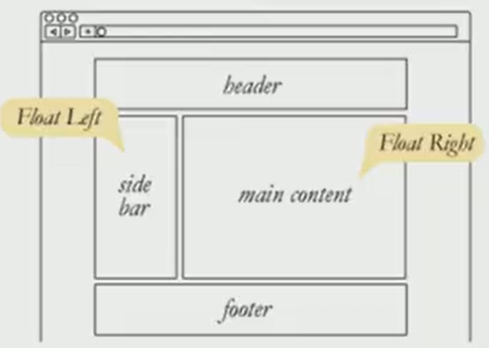
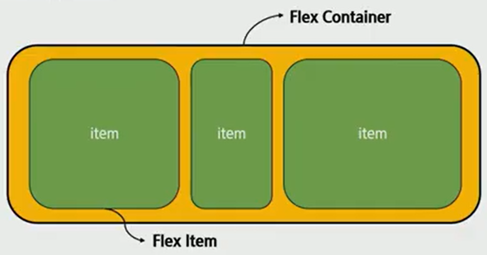
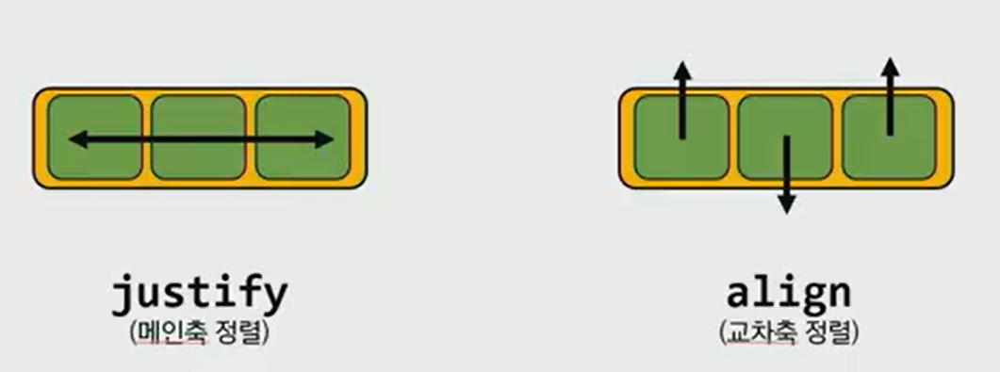
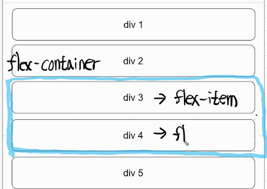
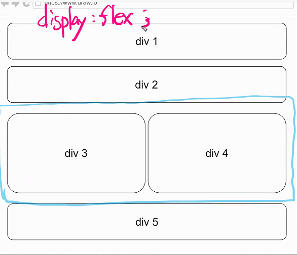
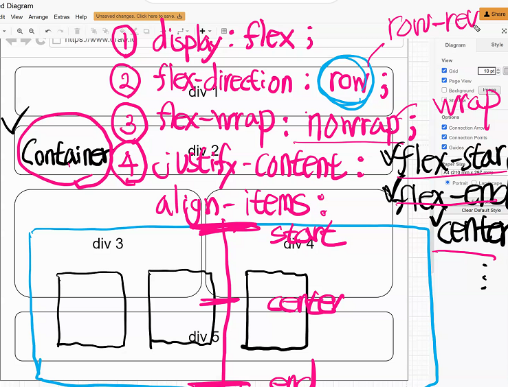
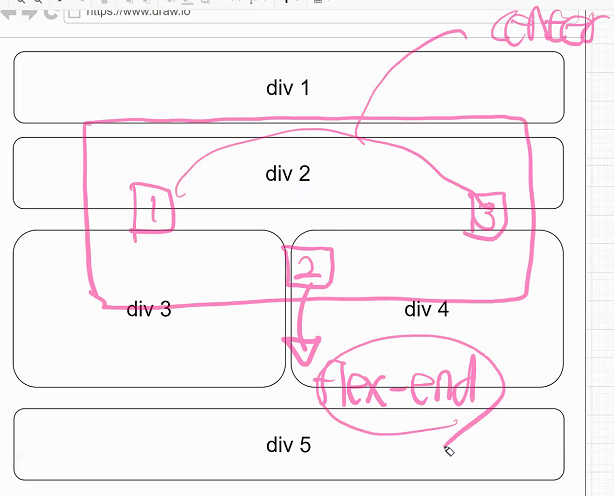

이전 CSS 수업에 이어....

이전 CSS수업에서는 수평정렬하는 것이 어려웠었음.

display를 inline block 으로 바꾸기로 하였다 이전엔.

오늘은 `floa`t와 `flex`를 배워볼것임

이렇게 다양한 방법이 있지만 **앞으로 수평정렬은 `flex`만 생각하자**

애초에 수평정렬을 위해 나온 flex라는 친구를 사용하는 것이 안정적이기 때문에!

## CSS layout

>  웹페이지에 포함되는 요소들을 취합하고 그것들이 어느 위치에 놓일 것인가를 제어하는 기술

display, position 역시 레이아웃 기능에 포함되는 아이들이었고 추가적으로 float, flexbox, gird 등이 있다.

우리가 수평정렬을 하고싶으면 특정 공간을 선택해서 이안의 부분은 수평정렬 할래라고 지정해줘야한다.

## float

>  정상적인 html흐름을 벗어나는 방식

원래 float의 용도는 텍스트 중간에 이미지 하나를 붕 띄워 넣어 레이아웃을 주기 위해 사용하였다.

현재는 단순한 이미지를 텍스트를 감싸는게 아니라 다른요소들에 적용하여 웹사이트 전체 레이아웃 만드는데까지 발전. 

... 그러나 float을 사용하면서 문제가 너무 많아져 최초의 목적으로 돌아감.

그러면서 등장한 `flexbox`!

## flexbox

> 정식 명칭은 css flexible box layout

> 요소간 공간배분과 정렬을 위한 **1차원 단방향 레이아웃**(왼쪽에서 오른쪽으로 쌓임)

크게 딱 2가지만 기억하자... `요소`와 `축`!!

## 1. 요소 

### (1) flex container(부모요소) - 조작의 주체

flex모델을 구성하는 가장 기본적인 모델

flex부모로서 flex박스들이 모여있는 영역을 표시함

따라서` flex container`를 만들면 **안에있는 요소들을 **`item`**으로 만들어버림**

결국, **flex contanier를 통해 안의 요소를 조작**하는 것임

보통 아이템은 왼쪽에서 오른쪽으로(row) 쌓이는 행으로 나열된다.

### (2) flex time (자식요소)

### 요소 쉽게 기억하기

* content : 여러줄
* items : 한 줄
* self : flex item 개별요소
* 대표적 예시
  * **justify-content** : **메인축** 기준 여러 줄 정렬

  * **align-items** : **교차축** 기준 한 줄 정렬

  * **align-self** : 교차축 기준 **선택한 요소 하나 정렬.** 

    ​					얘는 개별요소에 작성해야함. 개별요소를 컨트롤하는 것이기 때문에. 

## 2. 축

### main axis (메인축)과 cross axis(교차축)

위 그림은 flex-direction이 `row`일 때의 방향이며 flex-direction을 `cloum`으로 바뀌면 좌우 그림의 **화살표 방향이 서로 바뀐다**

## flex에 적용하는 속성

* **배치 방향** 설정

  * 	flex-**direction** (row, column)

* **메인축** 방향 정렬

  * 	**jusify**-content

* **교차축** 방향 정렬

  * 	**align**-items, align-self, align-content

* 기타

  * 	flex-wrap, flex-flow, flex-grow, order 

  

---

만약 아래의 div 3, div 4만 **수평정렬** 하고싶을 때,

`display : flex`적용하면 아래와 같이 된다

​		

flex-direction은 `row`가기본이라 `div 3` `div 4` 위와 같이 정렬된다.  

만약 **수직정렬**하고싶으면, flex-direction : `column` 으로 바꿔주면 된다

---

### container에 넣을 수 있는 속성

1. `display:`  flex;
* 컨테이너 밑 div를 모두 관리하겠다고 선언하는 것

2. `flex-direction:` row;
* 주축을 변경해줌. 
* 주축이 바뀌면 교차축도 다른 축으로 바뀜
   * `row`: 요소들을 좌에서 우로 정렬합니다.
   
   * `row-reverse`: 요소들을 텍스트의 반대 방향으로 정렬합니다.
   
   * `column`: 요소들을 위에서 아래로 정렬합니다.
   
   * `column-reverse`: 요소들을 아래에서 위로 정렬합니다.
   
     
   
3. `flex-wrap:` nowrap;

* 아이템들이 많이 쌓이다 보면 너비가 길어 초과되는 경우가 있는데, 
nowrap상태는 초과되는 부분들까지 더해져 자꾸만 작아지고 화면에서 넘친다
* wrap은 컨테이너 범위를 벗어나지 않도록, 밑으로 내려주는 기능을 한다. 
   * `nowrap`: 모든 요소들을 **한 줄에 정렬**합니다.
   
   * `wrap`: 요소들을 **여러 줄에 걸쳐 정렬**합니다.
   
   * `wrap-reverse`: 요소들을 여러 줄에 걸쳐 **반대로 정렬**합니다.
   
     

4. `justify-content:`
* **주축을 기준**으로 컨테이너 안의 아이템들을 요리조리 배치할 수 있다. 

* 주축과 교차축이 존재하는 상태라는 것을 언제나 기억하고 결과를 생각하자!
  
   * `flex-start`: 요소들을 컨테이너의 왼쪽으로 정렬합니다.
   * `flex-end`: 요소들을 컨테이너의 오른쪽으로 정렬합니다.
   * `center`: 요소들을 컨테이너의 가운데로 정렬합니다.
   * `space-between`: **요소들 사이에 동일한 간격**을 둡니다.
   * `space-around`: **요소들 주위에** **동일한 간격**을 둡니다.
   
   
5. `align-items :` 
* **교차축을 기준**으로 컨테이너 안의 **한 줄 짜리**아이템들을 요리조리 배치할 수 있다. 
  
   * `flex-start`: 요소들을 컨테이너의 꼭대기로 정렬합니다.
   * `flex-end`: 요소들을 컨테이너의 바닥으로 정렬합니다.
   * `center`: 요소들을 컨테이너의 세로선 상의 가운데로 정렬합니다.
   * `baseline`: 요소들을 컨테이너의 시작 위치에 정렬합니다.
   * `stretch`: 요소들을 컨테이너에 맞도록 늘립니다.
   
   
6. `align-content :`

   * 교차축을 정렬하는 것, 줄바꿈이 되어 **두 줄 이상일 때**
   * `flex-start`: 여러 줄들을 컨테이너의 꼭대기에 정렬합니다.
   * `flex-end`: 여러 줄들을 컨테이너의 바닥에 정렬합니다.
   * `center`: 여러 줄들을 세로선 상의 가운데에 정렬합니다.
   * `space-between`: 여러 줄들 사이에 동일한 간격을 둡니다.
   * `space-around`: 여러 줄들 주위에 동일한 간격을 둡니다.
   * `stretch`: 여러 줄들을 컨테이너에 맞도록 늘립니다.

   

7. `align-self :`

   * 개별 요소에 적용할 수 있는 또 다른 속성
   *  `align-items`가 사용하는 값들을 인자로 받으며, 그 값들은 지정한 요소에만 적용

   

8. `flex-flow :` column wrap;
   
   * `flex-direction`과 `flex-wrap`이 자주 같이 사용되기 때문에, `flex-flow`가 이를 대신할 수 있습니다.
   
   * 공백문자를 이용하여 두 속성의 값들을 인자로 받습니다.
   
     
   
   

### 크게 아래 3가지에 주목하자

1.  **justfy-content 주축을 정렬**하는 것

2. **align-items  교차축을 정렬**하는 것, **한 줄 일때**

3. **align-content 교차축을 정렬**하는 것, 줄바꿈이 되어 두 줄 이상일 때

---

`row` 기준일 때 **flex-start**와 **flex-end**의 위치와 방향! 

`row-reverse`가되면 start와 end가 서로 바뀐다

만약, 나머지는 center로 가운데에 두고 2번 상자만 flex-end시키고 싶을 때는 어떻게 해야할까?

2번 상자만 `align-self`해준다!

따라서, align-self는 컨테이너가 아닌 **개별 item에 써주는 속성**이다

**center랑  align-self 충돌하면** 이렇게 개별 아이템에게 먹이는  **align-self가 우선시**되기 때문이다 

# 사이트 소개

## 1. CSS 연습 - `Flexbox Froggy`

[플렉스박스 프로기](https://flexboxfroggy.com/#ko)

## 2. CSS 연습 - `Flexbox Defense`

[플렉스박스 디펜스](http://www.flexboxdefense.com/)

## 3. `Can I use`

이 사이트에 들어가면 html 또는 최신 웹기술을 사용해도 되는지 안되는지 알 수 있다. 특히 html은 계속 업그레이드 되고 변화하는 언어기 때문에 새로 나온 태그에 대해선 확인을 꼭 해줘야 한다.

크로스 브라우징(Cross Browsing)이란 웹페이지를 만들 때 W3C와 같은 web standard에 맞는 코딩을 함으로서 어느 브라우저, 기기에서나 사이트가 제대로 보여지고 작동되는 것을 말한다. 

IE(Internet Explorer)가  항상 크로스 브라우징에서 문제를 일으키는 이유는 IE가 웹규격을 따르지 않기 때문이다. 따라서 Can I Use 사이트에 들어가 확인해야 한다. 

flex

​	

캐시 비우기 위해서

강력새로고침 하기

개발자도구 열고 새로고침 버튼 위에 커서 올리면됨

