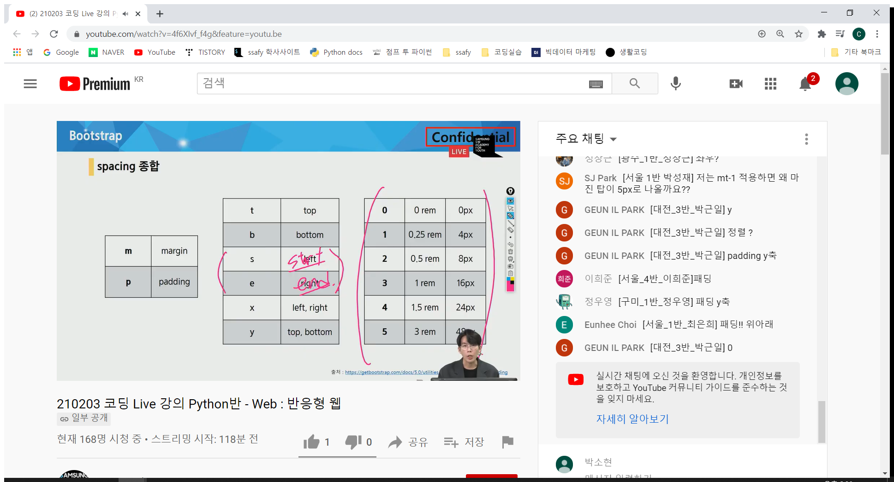

[toc]

들어가기 전에..

#### 크롬 익스텐션 설치, [Wappalyzer](https://chrome.google.com/webstore/detail/wappalyzer/gppongmhjkpfnbhagpmjfkannfbllamg?hl=ko)!

> 웹페이지가 어떤 프레임워크, 라이브러리 등을 가지고있는지 보여줌. 
>
> 그러나 몇몇 웹사이트들은 해당 기능을 쓸 수없도록 해놓음. 

# [Bootstrap](https://getbootstrap.com/)

>  html, css, javascript 라이브러리이며 프론트엔드를 할 때 자주쓰이는 요소들에 대해 내장하고있음. 

>  또한, Bootstrap을 사용하면 반응형 웹사이트를 빨리 구축할 수 있다

>  Netflix, VOGUE 도 bootstrap사용

[참고]

 `반응형(responsive)`
: 고정된게 아니라 **어떤 디바이스 환경으로 보던간에 **편안히 볼 수 있다

	`one source, multi use`

우리가 Bootstrap사용하면 우리가 사용하던 **html과 약간은 다르게 보일 수 있음**

홈피 들어가서 `Compiled CSS and JS` 다운로드 받기

다운받으면 css, js 파일 2개가 들어있다.

css폴더 안의 bootstrap.css 파일과, js폴더 안의 bootstrap.bundle.js 파일을그대로 내가 작성하고자 하는 파일의 경로와 같은 곳에 끌어다 놓는다.

그 다음 html코드에 다음과 같이 기재하면 Bootstrap import가 완료된다.

## CDN

>  파일을 다운받아 사용하는 것이 아니라 **링크를 통해 온라인상의 주소로 가져와 쓸 수 있음.** 

>  외부서버를 활용함으로서 **본인 서버의 부하가 적어짐.** 

>  또한, 한 번 불러오면 **캐시**상에 남아있어 **다음에 또 다시 불러오지 않아 더 빨라**질 수 있다.

[Bootstrap](https://getbootstrap.com/)의 docs 메뉴에서  CDN을 가져올 수 있다. **CDN은 min형식**으로 되어있음.

앞으론 귀찮게 import방식을 사용하지 않고, **CDN 방식으로 Bootstrap을 사용**할거임!

[참고]

bootstrap.css 를 Minified 하면 bootstrap.**min**.css가 된다.

bootstrap.min.css란, 많은 줄의 코드를 한 줄안에 많이 넣어둔 min버전!

따라서, min을 사용하면 서버에서 부하가 덜 걸릴수 있다.

 .mt-1은 bootstrap.css에있는 코드의 일부이다. 

우린 라이브러리를 사용하고 있기 때문에 이들을 사용하기 위해선 해당 라이브러리 규칙을 확인해야 한다.

그러나 전혀 동떨어진 규칙이 아니다. 기존에 사용하던 css, html규칙안에 속해있던 명명법을 많이 따왔다.

s는 start, e는 end 의 의미! 기억하자

## color

## responsize Web Design

>  다양한 화면크기를 가진 디바이스들이 등장함에 따라 등장하게된 개념

같은 화면을 다르게 나타내는 각기 다른 디바이스들! 

왼쪽부터, 컴퓨터, 아이패드, 모바일 화면이다.

이는, 세 가지의 다른 화면을 일일이 .html파일로 디바이스별 화면을 따로 만드는 것이 아님!

## bootstrap grid system

>  그냥 그리드가 아닌 내부적으로 flexbox로 grid를 구현을 해놓음

> css의 grid와는 다른 개념이다!

#### 반드시 기억해야할 2가지!

1. **12개**의 **컬럼**
2. **6개**의 **계층구조**(breakpoints)
   * 창을 점점작게 만들면 viewport도 점점 달라지는데 그 간극이 6개 존재한다

[참고]

viewport란, 웹페이지가 사용자에게 보여지는 영역을 말함.

일단 사용해보자

저 핑크색 박스가 행이다.

12개의 행

왜 12개로 나뉘엇을까?

12는 약수가 많아서!

1 2 3 4 6 12

약수가많다 == 레이아웃을 다양하게 짤 수 있다.

