[TOC]

# 들어가기 전에...

파이썬을 공부하기 위해선 [Python docs](https://docs.python.org/ko/3.8/) [스텍오버플로우](https://stackoverflow.com/) 사이트를 많이 참고할 것!


웹은 [MDN docs](https://developer.mozilla.org/ko/)를 많이 참고해! 가장 표준에 가까운 문서기 때문에.

MDN으로 구글링 하려면 `html a tag mdn`이라 검색하면 된다.


# HTML

> HyperText Markup Language의 약자
>
> "웹 컨텐츠의 의미와 구조를 정의할 때 사용하는 언어"
>
> 각각의 HTML 태그는 웹 페이지의 디자인이나 기능을 결정하는데 사용

```html
<h1>제목 1</h1>

<h2>제목 2</h2>

<h3>제목 3</h3>

<p>단락 1</p>

<p>단락 2</p>
```


## HTML 기초

**Hyper**

- 텍스트 등의 정보가 동일 선상에 있는 것이 아니라 다중으로 연결되어 있는 상태

**Hyper Text**

- 참조(하이퍼링크)를 통해 사용자가 한 문서에서 다른 문서로 즉시 접근 할 수 잇는 텍스트
- 하이퍼 텍스트가 쓰인 기술등 중 가장 중요한 2가지 (http, html)

**Markup Language**

- **특정 텍스트에 역할을 부여**하는, 따라서 "마크업을 한다" 라고 하는 건 제목이 제목이라하고 본문이 본문이라고 마킹을 하는 것
- ex) **h1 tag**는 단순히 **글자가 커지는 것**이 아니라 의미론적으로 그 페이지에서 **가장 핵심 주제를 의미**하는 것

<br>


## HTML 기본 구조와 태그


### HTML 태그(tag)

HTML 태그는 태그 이름을 꺾쇠 괄호(<>)로 감싸서 표현합니다.

```html
1. <태그이름>  // 시작 태그

2. </태그이름> // 종료 태그
```

태그에 따라 시작 태그만 있고 종료 태그가 없는 태그도 존재합니다.


#### [참고] 닫힌태그와 열린태그

* 닫힌태그 ==빈(empty 태그)

  * `<meta charset="utf-8">`

* 열린태그

  * `<title>Hello, HTML</title>`


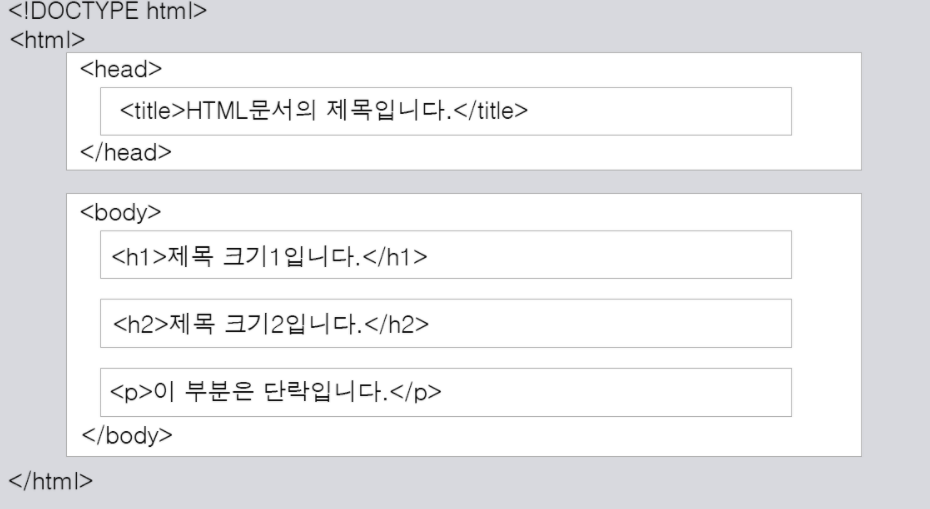


`<!DOCTYPE html>` : 현재 문서가 HTML5 문서임을 명시합니다.

`<html>` : HTML 문서의 루트(root) 요소를 정의합니다. 

`<head>` : HTML 문서의 **메타데이터(metadata)를 정의**합니다.

\- 메타데이터(metadata)란 HTML 문서에 대한 정보(data)로 **웹 브라우저에는 직접적으로 표현되지 않는 정보**를 의미합니다.

\- 이러한 메타데이터는 `<title>`, `<style>`, `<meta>`, `<link>`, `<script>`, `<base>`태그 등을 이용하여 표현할 수 있습니다.

* `<title>` : HTML **문서의 제목(title)을 정의**하며, 다음과 같은 용도로 사용됩니다.

​	\- 웹 브라우저의 **툴바(toolbar)에 표시**됩니다.

​	\- 웹 브라우저의 즐겨찾기(favorites)에 추가할 때 **즐겨찾기의 제목**이 됩니다.

​	\- **검색** 엔진의 결과 페이지에 제목으로 표시됩니다.


 `<body`> : **웹 브라우저를 통해 보이는 내용**(content) 부분입니다.

 * `<h1>` ~ `<h6>` : **제목**(heading)을 나타냅니다.
   	* 여러 검색엔진은 각 웹 사이트의 내용을 바로 이 `<h>`태그를 이용하여 키워드를 수집하고, 그 내용을 파악
      	* 따라서 HTML 문서에 포함되는 제목은 `<h>`태그로 작성해야만 검색엔진에 의해 제대로 검색될 확률을 높일 수 있음.
 * `<p>` : **단락**(paragraph)을 나타냅니다.
   	* 단락이란, 내용상 끊어서 구분할 수 있는 하나하나의 부분을 의미하며, 문단이라고도 부릅니다.

```html
<h1>가장 중요한 h1제목</h1>
<!-- p태그 안에서 엔터를 한 번 쳐보고-->  
  <p>paragrah의 약어인 p태그
    과연 그대로 출력이 될까요
<!-- 엔터를 여러번 쳐봐도-->  

    
    허허허
  </p>
```

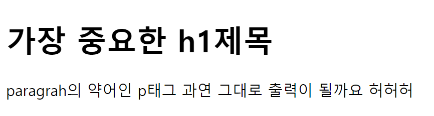


이와 같이 **한 번의 스페이스**로 인식될 뿐...!


#### `<br>`태그를 사용하자!

```html
<body>
  <h1>가장 중요한 h1제목</h1>
<!--br태그를 사용해 한 줄을 띄움-->
  <p>paragrah의 약어인 p태그<br>
<!--br태그를 또 사용해 두 문장 사이를 띄움-->
    <br>
    과연 그대로 출력이 될까요

    
    허허허
  </p>
  
```

`<br>`태그는 종료 태그가 없는 빈 태그 입니다.

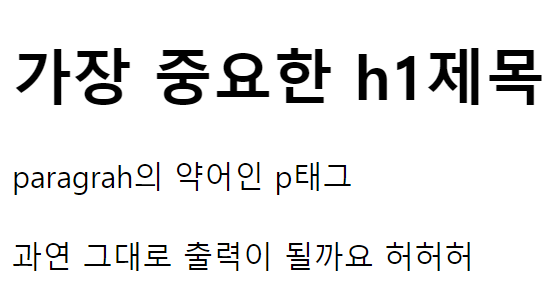


#### `<hr>`로 가로 구분선을 만들자


```html
  <p>첫 번째 단락</p>
  <hr>
  <p>두 번째 단락</p>
  <hr>
  <p>세 번째 단락</p>
```


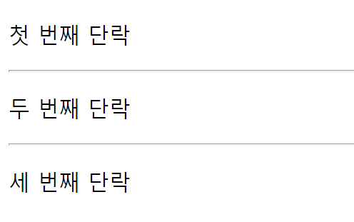


### 서식

> 텍스트(text)에 다양한 효과를 주는 여러 태그


#### 굵은글자(강조효과)

`<b>`(bold)태그나 `<strong>`태그


```html
<body>
  <p> 내가 바로 <b>박소현</b>이다
  하하하하하하하ㅏ하
<strong>강한여성</strong>이지 ㅋㄷ</p>
</body>
```


* `<strong>`태그는 단순히 글자를 굵게해줄 뿐만 아니라 내용이 중요하다는 의미도 함께 포함


### 이탤릭체

`<i>`(italic)태그 혹은 `em`(emphasized)태그


```html
<body>
  <p> 내가 바로 <i>박소현</i>이다
  하하하하하하하ㅏ하
<em>강한여성</em>이지 ㅋㄷ</p>
</body>
```


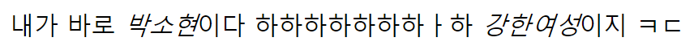

* `em`태그 역시 글자를 이텔릭체로 변환해주면서 동시에 중요하다는 의미도 함께 포함


[참고]

검색엔진은 `<string>`, `<em>`태그를 사용하여 강조된 텍스트를 더 중요히 인식합니다.


#### 하이라이팅 효과

`<mark>`태그는 텍스트에 형광펜을 칠한 것 과 같은 효과를 적용시킴

```html
<body>
    <p> 내가 바로 <mark>박소현</mark>이다</p>
</body>
```


#### 삭제효과

`<del>`태그는 텍스트 중앙에 가로줄을 만드는 효과를 적용시킴

```html
<body>
    <p> 내가 바로 박소현<del>이다</del></p>
</body>
```


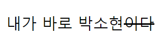

#### 삽입효과

`<ins>`태그는 밑줄을 그어주는 효과를 냄

```html
<body>
    <p> 내가 바로 박소현<ins>이다</ins></p>
</body>
```


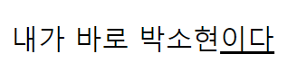


### HTML Style

>HTML 요소의 style 속성(attribute)을 이용하면 **CSS 스타일을 HTML 요소에 직접 설정**할 수 있습니다.

`<태그이름 style="속성이름:속성값">`


#### 여러 스타일 설정

여러 스타일을 한 번에 설정할 땐 `;`으로 구별해주어야 합니다.

만약 `;`으로 구분되지 않았을 시 `;`전 혹은 후의 스타일이 적용되지 않습니다.

```html
    <h1 style="background-color:red ; color:white; font-size: 50px; text-align:center">

      html의 style 속성을 사용하여 css스타일을 html요소에 직접 설정 중
  
  </h1>
```


* `text-align` : style속성을 이용한 문단정렬


### HTML 색 표현

> 총 3가지의 방법이 있다.
>
> 1. 색상 이름으로 표현
> 2. RGB값으로 표현
> 3. 16진수 값으로 표현


#### 1. 색상 이름으로 표현


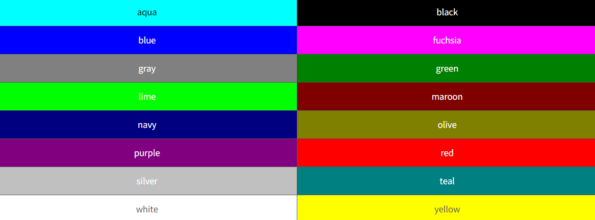

```html
<h1 style="color:blue">파란색</h1>

<h1 style="color:red">빨간색</h1>
```

그러나 보통 bootstrap의 색상이름으로 표현하는 것을 선호하기 때문에.. 패스


#### 2. RGB값으로 표현

빛은 섞일 수록 희색이 되는 원리 기억하자! 모니터로 보는 색깔들 역시 빛이기 때문에 같은 맥락이다.

RGB값은 **빨, 녹, 파**란색을 혼합하여 색을 표현하며 이들은 각각 **0부터 255까지의 범위**를 가진다.

```html
<h1 style="color:rgb(0,0,255)">RGB로 표현된 파란색</h1>

<h1 style="color:rgb(255,0,0)">RGB로 표현된 빨간색</h1>
```


#### 3. 16진수 값으로 표현

이는 RGB값을 각각 16진수로 변환한 것.

따라서 빨, 녹, 파란색은 각각 00부터 FF까지의 범위를 가진다.

```html
<h1 style="color:#0000FF">16진수로 표현된 파란색</h1>

<h1 style="color:#FF0000">16진수로 표현된 빨간색</h1>
```


### HTML 링크(Link)

하이퍼링크를 간단히 링크라고도 부르며 HTML서는 이를 `<a>`태그로 표현

`<a href="링크 URL">부연설명</a>`


[참고]

`<a>`태그는 텍스트나 단락, 이미지 등 다양한 HTML 요소에 사용할 수 있습니다.


### HTML 이미지

``태그는 종료가 없는 빈 태그, 닫힌 태그

``


#### 이미지 크기 설정 (width, height)

CSS를 이용한 내부 스타일 시트나 외부 스타일 시트와 상관없이 **이미지의 원래 크기를 유지하려면** `style`속성을 사용하는 것이 좋다.

```html
<style>
    img {
        width:100%;
        border: 1px solid black;
    }
</style>
```


#### 이미지에 링크(Link) 설정

이미지에 `<a>`태그를 이용하여 링크를 설정할 수 있다.

```html
<a href="/html/intro" target="_blank">
    
</a>
```


#### HTML 리스트(List)

HTML에는 총 3가지의 리스트가 있습니다

> 1. 순서가 없는 리스트
> 2. 순서가 있는 리스트
> 3. 정의 리스트


##### 순서가 없는 리스트(Unordered list)

`<ul>`태그로 시작하며 여기에 포함되는 리스트 요소는 `<li>`태그로 시작

```html
<ul>
    <li>노트북</li>
    <li>마우스</li>
    <li>스피커</li>
</ul>
```

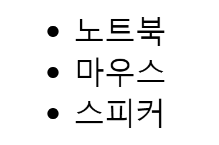


##### 순서가 있는 리스트(Ordered list)

`<ol>`태그로 시작하며 여기에 포함되는 리스트 요소는 `<li>`태그로 시작

```html
<ol>
    <li>노트북</li>
    <li>마우스</li>
    <li>스피커</li>
</ol>
```

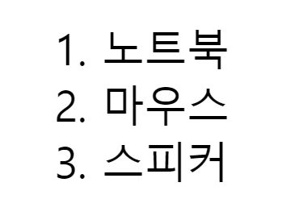


##### 정의가 있는 리스트(description list)

`<dl>`태그로 시작하며 여기에 포함되는 리스트 요소는 

`<dt>`태그에는 용어의 이름이 `<dd>`태그에는 용어의 정의가 들어갑니다.

```html
<dl>
    <dt>거북이</dt>
    <dd>느릿느릿</dd>
    <dt>토끼</dt>
    <dd>빠릿빠릿</dd>
</dl>
```

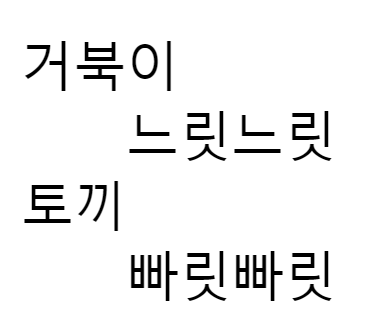

### HTML 테이블

1. `<table>`태그를 사용하여 표를 나타내줄 수 있다.

2. `<tr>`(table row)태그는 **열을 구분**해준다.

3. `<th>`(table head)태그는 **각 열의 제목**을 나타내며 자동으로 **굵은 글씨**에 가운데 정렬이 된다.

4. `<td>`(table data)태그는 열을 각각의 **셀**로 나누어 준다.

```html
  <body>
    <table style="width:100%">
      <tr style="background-color:lightgrey">
          <th>한글</th>
          <th>영어</th>      
      </tr>
      <tr>
          <td>가나</td>
          <td>ab</td>
      </tr>
      <tr>
          <td>다라</td>
          <td>cd</td>
      </tr>
  </table>
  </body>
```

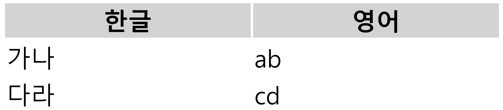


## HTML 블록과 인라인

HTML의 모든 요소는 **display 속성**을 가집니다.

display 속성이란, **웹 브라우저에 어떻게 보이는가를 결정짓는 속성**입니다.


이러한 display 속성값으로 다음 두 가지 값 중 하나를 가지게 됩니다.

 

1. **블록(block)**

2. **인라인(inline)**


### block 타입 요소

display 속성값이 block인 요소는 **언제나 새로운 라인에서 시작**하며 **해당 라인 모든 너비를 차지.**


`<p>`, `<div>`, `<h>`, `<ul>`, `<ol>`, `<form>`요소는 display속성값이 block인 대표적 요소.


* `<p>`태그 예시

```html
<p style="border: 3px solid red">
    P태그는 block속성
</p>
```

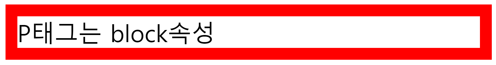


* `<div>` 태그 

  * 대표적인 **display가 block인 요소**
  * 다른 html요소들을 하나로 묶을 때 사용
  * 주로 여러 스타일을 한 번에 적용하기 위해 사용됨

  

[주의]

block요소에만 text-align 속성을 적용할 수 있다.

정렬되는 것은 block요소 안에 있는 inline요소만 가능함.

```css
<!DOCTYPE html>
<html>
  <body>
    <div class="inline-wrap">
      <!-- text가 span이라는 inline tag에 둘러 쌓여 있습니다.-->
      <span class="inline">text</span>
    </div>
  </body>
</html>
```

이럴 경우엔 `<span>`의 **부모인**`<div>`에 text-align을 적용해줘야 한다.

inline인 경우 text의 width에 맞춰서 영역이 생기기 때문에 text를 center로 할 공간이 없기 때문.

그래서 center를 하려는 element의 block인 부모에 center를 지정해줘야 합니다.


### inline 타입 요소

display 속성값이 inline인 요소는 **새로운 라인에서 시작하지 않음.**

**요소의 너비**도 해당 html요소의 **content만큼만 차지**.

**width, height가 적용되지 않는다.**


`<span>`,`<a>`,``, `<label>`태그는 display 속성값이 inline인 대표적 요소.


`<span>`태그는 **텍스트의 특정 부분만을 스타일 적용할 때** 자주 사용되는 inline요소


* `<span>`태그 예시

```html
<p>
    <span style="background-color : black; color: red">span태그</span>
    는 inline 속성값을 가짐
</p>
```


### HTML 레이아웃

> 웹상에 여러 구성요소를 보기 좋게 배치하는 작업


html에서 총 3가지 방법으로 레이아웃 가능

1. `<div>`를 활용
2. html5 레이아웃
3. `<table>`를 활용(거의 사용X)


#### `<div>`를 활용한 **레이아웃**

`<div>`요소는 CSS스타일을 쉽게 적용할 수 있어 레이아웃 시 자주 사용된다.

```html
<body>
  <div id="header" style="text-align: center; color: red;">
  <h2>Header 영역</h2>
</div>
<div id="nav" style="text-align: end;">
  <h2>Nav 영역</h2>
</div>
<div id="section">
  <p>Section 영역</p>
</div>
<div id="footer">
  <h2>Footer 영역</h2>
</div>
</body>
```


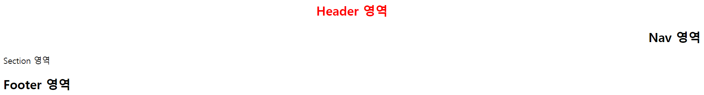


## 시맨틱 요소

> 브라우저, 검색엔진, 개발자 모두에게 콘텐츠의 의미를 명확히 설명하는 태그

HTML5에서는 **웹페이지 레이아웃을 위한 요소**들을 새롭게 제공.

의미가 있다는 의미에서,  시맨틱 요소라고 부름.


### 장점

1. **읽기 쉬워진다.** (개발자)
   - 개발자가 의도한 요소의 의미가 명확히 드러나고 있다.이것은 코드의 가독성을 높이고 유지보수를 쉽게 한다.
2. **접근성이 좋아진다.** (검색엔진 및 보조기술 → 시력장애용 스크린리더 → 더 나은 경험 제공)
   - HTML 문서는 html 언어 + 사람이 읽을 수 있는 content의 조합인데, 검색 엔진은 HTML 코드만 잘 읽는다.
   - 그래서 이 검색 엔진이 HTML을 잘 이해하도록 시맨틱 태그 사용이 권장되고, 그러면 검색 엔진도 무슨 내용인지 이해할 수 있게 된다

```bash
<b> 태그 : 글자를 굵게 vs <string> 태그 : 글자를 굵게, 의미강조. 시맨틱!
<i> 태그 : 글자를 기울임  vs  <em> 태그 : 글자를 기울임, 의미강조. 시맨틱! 
h1도 시맨틱 탭으로 볼 수 있다! 단순히 글자가 커지는 것 뿐 아니라 가장 중요한 부분이라는 것을 알려주기 때문에
```


### 시맨틱 웹

- 웹에 존재하는 수많은 웹페이지들에 **메타데이터를 부여**하여, 

  기존의 단순한 데이터 집합이었던 웹페이지를 '**의미**'와 '**관련성**'을 가지는 **거대한 데이터베이스**로 구축하고자 하는 발상.


[참고]

* 네이버 같은 웹페이지의 `소스코드`를 볼 수 있다.

  * `ctrl + shift + i`  : 단축키
  * 혹은 `F12`
  * 혹은 `마우스 오른쪽 - 검사` 를 해도 동일하다


* `<header>` 

  * **도입부**에 해당하는 콘텐츠(content)를 가지고 있는 부분

* `<nav>`

  * **링크의 커다란 집합**을 의미
  * 문서 내의 모든 링크가 nav 요소에 포함되는 것은 아님

* `<section>`

  * 문서의 **전체적인 내용과 관련이 있는 콘텐츠들의 집합**
  * 제목을 가지고 있음

* `<article>`

  * 독립적인 하나의 기사(article) 부분을 정의
  * 내용은 그 자체만으로도 이해가 되어야 하며, **웹 사이트의 나머지 부분과는 별도로 읽을 수 있어야** 합니다.

  

[참고] `<section>`과 `<article>`의 차이

대체로 section 요소는 HTML 문서의 전체적인 내용에 포함

article 요소는 문서의 **전체적인 내용과는 별도**로, 독립적인 내용이 들어갈 때 사용


* `<aside>`
  * 페이지 부분 이외 **content를 정의**
* `<footer>`
  * 일반적으로 사이트의 작성자나 그에 따른 저작권 정보, 연락처 등을 명시


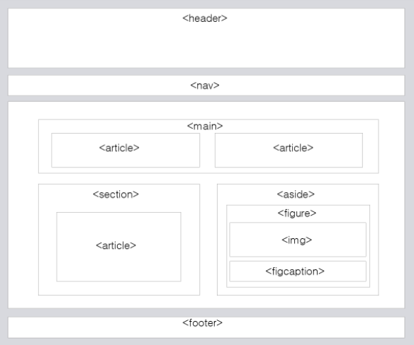


그외 시맨틱 태그

`<main>` : 주요 콘텐츠(content)를 정의

`<figure>` : 그래픽과 비디오 등의 독립적인 콘텐츠(content)를 정의


[참고] HTML5 이전의 레이아웃 코드

```html
<div id="header">
    <h2>Header 영역</h2>
</div>
<div id="nav">
    <h2>Nav 영역</h2>
</div>
<div id="section">
    <p>Section 영역</p>
</div>
<div id="footer">
    <h2>Footer 영역</h2>
</div>
```


## form 요소

> form 요소를 사용하여 **사용자로부터 입력**을 받을 수 있습니다.

> 또한, **사용자가 입력한 데이터를 서버로 보낼 때에도** form 요소를 사용합니다.


`<form action="처리할URL" method="get|post"></form>`

* `<action>` : 입력받은 **데이터를 처리할 서버 상의 스크립트 파일의 주소**를 명시.

* **폼 핸들러(form-handler)** : 전달받은 **데이터를 처리하는 스크립트 파일**

* `<method>` : 입력받은 데이터를 서버에 전달할 방식을 명시

  * **GET 방식**

    * **주소에 데이터(data)를 추가**하여 전달하는 방식
    * **데이터가 주소 입력창에 그대로 나타나**며, 전송할 수 있는 **데이터의 크기 또한 제한적**

    * 따라서 검색 엔진의 쿼리(query)와 같이 크기가 작고 중요도가 낮은 정보를 보낼 때 주로 사용

  * **POST 방식**

    * **데이터(data)를 주소가 아닌 곳에 별도로 첨부**하여 전달하는 방식입니다.
    * 데이터가 외부에 드러나지 않으며, 전송할 수 있는 데이터의 크기 또한 제한이 없습니다.
    * 따라서 **보안성 및 활용성이 GET 방식보다 좋습니다.**
    
    

````bash
form 요소를 통해 입력한 데이터는 action 속성에 명시된 form-handler위치로 method 속성의 방식을 통해 전달됨
````


#### form 안의 input 요소

```html
<form action="/examples/media/request.php">
    검색할 내용을 입력하세요 :
    <!--브라우저의 지원 여부에 따라 min,max 속성을 이용하여 숫자 선택에 제한값을 설정할 수도 있음-->
    <input type="text" name="search" min="1" max="9">
</form>
```


* `<input>` : 이를 통해 사용자로 부터 입력을 받을 수 있음.

  * 대표적 input 요소의 타입

    * 텍스트 입력(text)

    * 비밀번호 입력(password)

      *  화면에는 입력받은 문자나 숫자 대신 별표나 작은 원 모양이 표시됨

    * 라디오 버튼(radio)

      * 여러 개의 옵션(option) 중에서 **단 하나의 옵션만**을 입력받을 수 있음
      * **모든 input 요소의 `name 속성`이 같아야 함**

      ```html
      <form>
        <!--checked 속성 : 처음에 미리 선택되는 옵션을 지정할 수 있음-->  
          <input type="radio" name="lecture" value="html" checked> HTML <br>
          <input type="radio" name="lecture" value="css"> CSS <br>
          <input type="radio" name="lecture" value="java"> JAVA <br>
          <input type="radio" name="lecture" value="cpp"> C++
      </form>
      ```

      

    * 체크박스(checkbox)

      * 여러 개의 옵션 중에서 **다수의 옵션**을 입력받을 수 있음
      * **모든 input 요소의 name 속성이 같아야 함**
      * `checked` 속성 : 처음에 미리 선택되는 옵션을 지정할 수 있음
    
    ```html
      <form>
            <!--checked 속성 : 처음에 미리 선택되는 옵션을 지정할 수 있음-->
            <input type="checkbox" name="lecture" value="html" checked> HTML <br>
              <input type="checkbox" name="lecture" value="css"> CSS <br>
              <input type="checkbox" name="lecture" value="java"> JAVA <br>
           <!--disabled 속성: 해당 옵션을 선택할 수 없도록 설정-->
              <input type="checkbox" name="lecture" value="cpp" disabled> C++
          </form>
    ```
    
    * 선택 입력(select)
      * `option`이 **드롭다운 리스트(drop-down list)로** 되어 있으며, 그중에서 **단 하나의 옵션만**을 입력받을 수 있음
      * `selected` 속성 : 처음에 미리 선택되는 옵션을 지정할 수 있음
  
  ```html
      <select name="fruit">
      <!--selected 속성 : 처음에 미리 선택되는 옵션을 지정할 수 있음-->
          <option value="apple"> 사과
      <option value="orange" selected> 귤
          <!--disabled 속성: 해당 옵션을 선택할 수 없도록 설정-->
          <option value="strawberry" disabled> 딸기
          <option value="peach"> 복숭아
      </select>
  ```
  
  ​    
  
    * 버튼 입력(button)
    
      * 사용자가 누를 수 있는 버튼을 나타냄
    
    * 전송 버튼(submit)
    
      * 사용자로부터 입력받은 데이터(data)를 **폼 핸들러로 제출하는 버튼**을 만들 수 있음
      
      ```html
      <form action="/examples/media/request.php">
          어릴 때 자신의 별명을 적어주세요 : <br>
          <input type="text" name="nickname" value="별명"><br><br>
        <!-- input 요소의 입력 필드(input field)에 나타나는 초깃값을 설정-->
          <input type="submit" value="전송">
      </form> 
      ```
      
      

### HTML과 CSS

HTML 문서에 CSS 스타일을 적용하는 방법

 

1. **인라인 스타일(Inline style)**

2. **내부 스타일 시트(Internal style sheet)**

3. **외부 스타일 시트(External style sheet)**


[참고] 스타일 적용 우선순위

1. 인라인 스타일
   * HTML `요소 내부`에 style 속성을 사용
2. 내/외부 스타일 시트
   * HTML 문서의 `<head>`태그 내에 `<style>`태그를 사용
3. 웹 브라우저 기본 스타일
   * `<head>`태그 내에 `<link>`태그를 사용하여 외부 스타일 시트를 포함


#### HTML 문서에 CSS 스타일을 적용 - 1. 인라인 스타일

> HTML 요소 내부에 style 속성을 사용하여 CSS 스타일을 적용하는 방법
>
> **해당 요소에만 스타일을 적용**할 수 있음

```html
<p style="color:green; text-decoration:underline">
인라인 스타일을 이용하여 스타일을 적용하였습니다.
</p>
```


#### HTML 문서에 CSS 스타일을 적용 - 2. 내부 스타일 시트

>  HTML 문서의 `<head>`태그 내에 `<style>`태그를 사용하여 스타일을 지정
>
> 해당 HTML 문서에만 스타일을 적용할 수 있음

```html
<head>
  <meta charset="UTF-8">
  <meta http-equiv="X-UA-Compatible" content="IE=edge">
  <meta name="viewport" content="width=device-width, initial-scale=1.0">
  <title>Document</title>
  <style>
    body { background-color: lightyellow; }

    p { color: red; text-decoration: underline; }
  </style>
</head>
<body>
  <h1>나는야 제일 중요한 제목</h1>
  <p>안녕하세요 새 단락입니다</p>
</body>
```


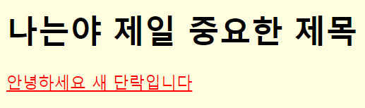


#### HTML 문서에 CSS 스타일을 적용 - 3. 외부 스타일 시트

> 웹 사이트 전체의 스타일을 하나의 파일에서 변경할 수 있도록 해줌
>
> `<head>`태그 내에 `<link>`태그를 사용하여 외부 스타일 시트를 포함하면 됨

```html
<link rel="stylesheet" href="/examples/media/expand_style.css">
```

`href="참조파일/외부리소스 경로"` 

`<link>`태그의 `rel=""`속성은 반드시 명시되어야 하는 **필수 속성**입니다.


이 속성값은 여러가지가 있는데 그 중 `stylesheet` 속성값은, 

스타일 시트(stylesheet)로 사용할 **외부 리소스를 불러올 때 사용**합니다.


### CSS 선택자(selector)

>  스타일을 적용할 HTML 요소를 선택하는데 사용하는 선택자

 

대표적인 선택자

\- HTML 요소 선택자

\- 아이디(id) 선택자

\- 클래스(class) 선택자


#### CSS 선택자 - 1. HTML 요소 선택자

> HTML 요소의 이름을 직접 사용

```html
<style>
    h2 { color: teal; text-decoration: underline; }
</style>
...
<h2>이 부분에 스타일을 적용합니다.</h2>
```


#### CSS 선택자 - 2. id 선택자

```html
<style>
    #heading { color: sandybrown; text-decoration: line-through; }
</style>
...
<h2 id="heading">이 부분에 스타일을 적용합니다.</h2>
```


#### CSS 선택자 - 3. class 선택자

> 특정 집단의 여러 요소를 한 번에 선택할 때 사용

```html
<style>
    .headings { color: deepskyblue; text-decoration: overline; }
</style>
...
<h2 class="headings">이 부분에 스타일을 적용합니다.</h2>
<p>클래스 선택자를 이용하여 스타일을 적용할 HTML 요소들을 한 번에 선택할 수 있습니다.</p>
<h3 class="headings">이 부분에도 같은 스타일을 적용합니다.</h3>
```


#### CSS 선택자 - 4. 그룹 선택자

> 위에서 언급한 여러 선택자를 같이 사용하고자 할 때 사용
>
> 여러 선택자를 쉼표(,)로 구분하여 연결
>
> 코드를 간결하게 만들어 주는 용도

```html
<style>
    h2 { color: navy; }
    h2, h3 { text-align: center; }
    h2, h3, p { background-color: lightgray; }
</style>
```


## HTML 요소 구조


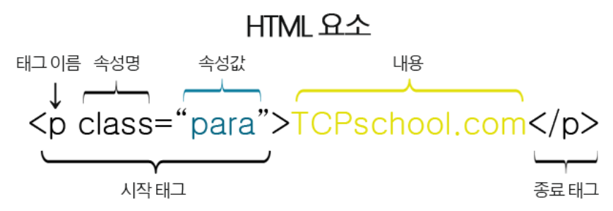


#### [참고] DOM

- DOM은 **문서의 구조화된 표현**(structured representation)**을 제공**하며 프로그래밍 언어가 DOM 구조에 접근할 수 있는 방법을 제공하여 그들이 문서 구조, 스타일, 내용 등을 변경할 수 있게 도움
- DOM은 동일한 문서를 표현하고, 저장하고, 조작하는 방법을 제공
- **웹 페이지의 객체 지향** 표현


### 요소 (Element)

- HTML 요소는 시작 **태그와** **종료 태그 그리고 태그 사이에 위치한** **내용**으로 구성
  
  - 태그(Element, 요소)는 컨텐츠(내용)를 감싸서 그 정보의 성격과 의미를 정의 한다.
- 내용이 없는 태그들
  
  - br, hr, img, input, link, meta
- 요소는 **중첩(nested)될 수 있다**.
  - 이러한 중첩들로 하나의 문서를 완성해 나간다.
  - 그리고 항상 열고 닫는 태그 쌍이 잘 맞는지 잘 봐야한다.
  - HTML은 오류를 뿜지 않고 그냥 레이아웃이 깨져버리기 때문에 어떤 면에서는 친절하게 오류 띄워주고 어디 틀렸는지 알려주는 프로그래밍 보다 디버깅이 힘들다.
  
  

### 속성 (Attribute)

- 요소는 속성을 가질 수 있으며 **요소에 추가적 정보(이미지 파일의 경로, 크기 등)를 제공**한다. 

- 요소의 시작 태그에 위치해야 하며 **이름**과 **값**의 쌍을 이룬다.

- 태그와 상관없이 사용 가능한 속성들(html global attribute)도 있다.

- 속성값은 언제나 **따옴표**로 감싸자!

```html
 <!--O-->

 <!--X-->
````


#### 00_first.html

* ! + tab 해주면 자동으로 아래구조가 생성된다.
* Boilerplate 중 하나다.

```html
<!DOCTYPE html> <!-- 덕타입. 이문서가 html이라는 것을 브라우저에게 말해줌 -->
<!--이게 없어도 동작은 하나, 비교적 옛날 버전을 따를 수 잇으니 최신버전을 따르게 하기 위해 적어주자-->
<html lang="en"> <!--문서언어는 영어-->
<head><!--html은 헤드와 바디로 구분된다. 그 중 head-->
    <!--head : 메타데이터를 정의하는 곳. 메타데이터는 해당 문서를 나타내는 각종 데이터를 말하며 웹페이지에 보이지 않음--> 
    <!--실수로 추가하지 않아도 브라우저가 자동으로 추가해준다.-->
    <meta charset="utf-8">
    <title>Hello, HTML</title> <!-- 본문이 아닌 웹페이지의 "탭부분"에 적혀져 나온다-->
</head>
<body><!--html의 나머지 큰 구성요소인 body. 웹페이지에 보이는 부분이다.-->
    <h1>나의 첫번째 HTML</h1><!--<h>는 tag와 content로 이루어진다.-->
    <a href="http://www.naver.com">네이버로 이동!</a><!--a태그. 하이퍼링크를 만들어준다.-->
    <!-- "네이버로 이동!" 과 같은 컨텐츠가 없으면 링크활성화가 안된다!--> 
    <p>이것은 본문입니다.</p>
</body>
</html>

```


#### 01_markup.html

```html
<!DOCTYPE html>
<html lang="en">
<head>
    <meta charset="utf-8">
    <title>학생건강설문</title>
</head>
<body>
    <header>
        <a href="https://www.ssafy.com"> </a>
        <!--이렇게 "네이버로 이동!" 과같은 글자가 아닌 "이미지"를 통해 링크를 연결시켜줄 수도 있다.-->
        <!--alt : 이미지가 오류나서 나오지못하였을 때 대체되어 나오는것.. 이미지경로나 이름을 잘못기재하였을 때도! 
				  시각장애인분들을 위한 기능. 이미지 대신 읽어줌.-->
        <h1>SSAFY 5기 학생 건강설문</h1>
        <section>
            <!-- 건강설문 작성 form -->
            <form action='보낼 서버 주소'>
                <div>
                    <label for = "name">이름을 입력해주세요 : </label>
                    <!--lable 요소는 사용자 "인터페이스 항목의 설명"을 나타낸다-->
                    <input type='text' id='name' autofocus>
                    <!--autofocus : 자동으로 커서가 input박스안에 들어가서 깜빡이게 된다.-->
                </div>
                
                <hr><!-- 줄로서 나눠주는 역할-->
                <!--지역선택-->
                <div>
                    <label for = 'region'>지역을 선택해주세요 :</label>
                    <select name='region' id='region'> <!--key value형식-->
                    <option value="" disabled selected>선택해주세요</option>
                        <!--disabled 선택불가능한 옵션. 그러나 랜더링은 됨-->
                    <option value="서울">서울</option>
                    <option value="대전">대전</option>
                    <option value="광주">광주</option>
                    <option value="구미">구미</option>
                    </select>
                </div>

                <hr>

                <!--체온선택-->
                <p>오늘의 체온을 선택하세요.</p>
                <input type='radio'id='normal'name='body=heat' value='normal'>
                <label for='normal'>37도 미만</label>
                <input type='radio' id='warning'name='body=heat'value='warning'>
                <label type='radio'>37도 이상</label>

                <hr>

                <input type='submit' value='SSAFY에 제출하기'>
                <!-- submit은 입력받은 데이터를 서버로 전송할 때 사용한다. 보통 "제출" 박스-->
                <!--제출하기를 누르면 주소 뒷부분이 바뀐다-->

                </form>


            <fotter>
                Google설문지를 통해 비밀번호를 제출하지 마시오.

            </fotter>
        </section>
    </header>
</body>

</html>
```


#### naver_search.html

```html
<form action='https://search.naver.com/search.naver'>
  <label for='query'> 검색어를 입력해주세요 : </label>
    <!-- name='query'를 작성해줘야 내가 입력한 값이 함께 전달되어 검색이 된다. -->
    <!-- name을 적지 않거나 label for=""과 내용이 다를 시 ""이 검색어가 되어 검색된다. -->
    <!-- id값은 현재는 있어도 그만 없어도 그만이다. 검색에는 지장을 주지 않는다. -->
  <input type='text' name='query' id='query'>
  <input type='submit' value='검색'>
</form>
```


[참고] id와 name의 차이점

* name 

  * 서버주소로 데이터가 들어갈 때 데이터값을 구분해주는 이름표
  * url에서 ? 이 뒷부분은 데이터인데 해당 데이터 이름을 정해주는 것이 name부분이며 보통 query라고 적는다. 구글은 q

* id 

  *  css개념을 사용해 페이지를 꾸밀때 특정 html영역을 빨간색으로 칠하라고 명령내려야 하는데 해당 부분을 선택할 때 사용. 
  * 선택자.

  

[참고] 랜더링이란?

> 그려준다는 것을 말함. html코드를 랜더링 한다라고 표현하는데, 코드를 브라우저 화면에 그려준다는 것을 말한다
