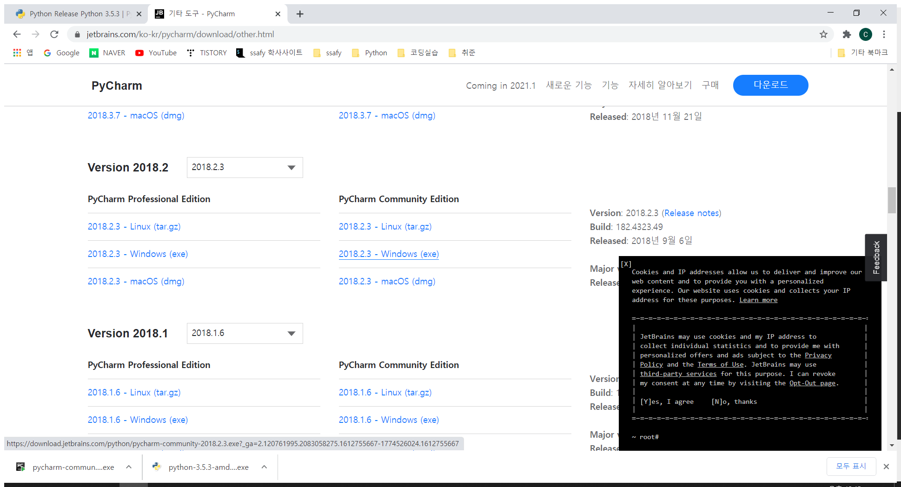
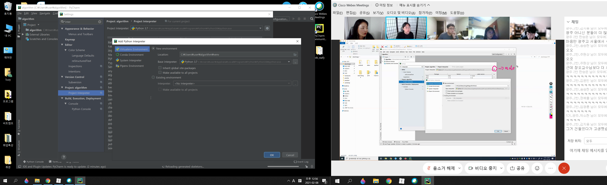
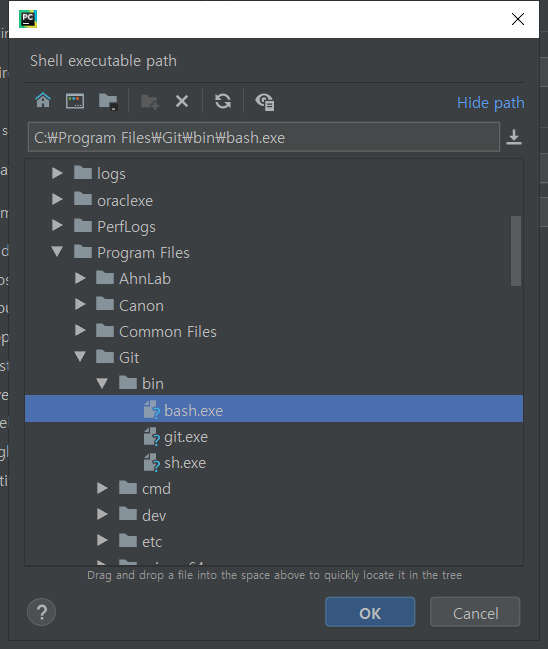
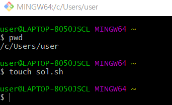
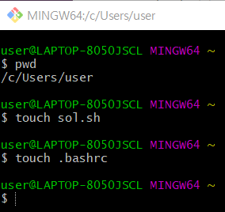

[toc]


## [SWEA](https://swexpertacademy.com/main/main.do)

SW Expert Academy - **알고리즘** 공부


## Pycharm(IDE tool)

다운로드 받자!

모든 APS수업은 pycharm으로 하자

앞으로  **pycharm환경에서 시험**쳐야 하기 때문에 **연습을 실전처럼** 하기 위해~~


## 알아두면 좋은 것들..


#### 1. 다양한 것들에 관심을 둘 필요가 있다.

문제를 풀다 보면 **실생활에 존재하는 개념**을 가지고 기출문제가 나올 때가 있다.

**야구**와 관련된 문제가 나오기도 함. 야구를 몰라도 풀 수 있게 나오긴 하지만 만약 실제 규칙을 안다면 조금은 더 빠르게 접근할 수 있기도 하다. 야구 이외에 **체스**나 **포커** 등이 있다.


#### 2. 지금부터 **내장함수는 전부 봉인**해두자!

.sort 혹은 sort()을 사용하지 말고.. 버블정렬, 카운팅정렬 등을 사용해서 문제를 풀자!

* 버블 정렬
* 카운팅 정렬
* 선택 정렬
* 퀵 정렬
* 삽입 정렬
* 병합 정렬


결국엔 나중에 다 도움이 되는 **코딩체력**과 연관이 되며 더 좋은 알고리즘을 작성할 수 있다.

max(), min() , count() 등.. 도 같다!


알고리즘은 수학과 굉장히 비슷함.

개념을 아는 것도 중요하지만 개념을 응용 하는 것이 더 중요함.


웹은 정답이 없는 경우가 많았음. 비슷한 모양을 만들어내기만 하는 것이 목표였지만, 

알고리즘은 정답을 찾아가는게 중요.


많은 문제 풀고 많은 고민하게 될 것임.


## 환경설정

#### 1. Python 3.5.3 설치

시험을 보는, 역량테스트에 맞춰진 쪽으로 환경설정 할 것임.


이렇게 설치를 끝내고 나면,

3.8(웹기준), 3.5(알고리즘 기준) 두가지 설치 되 있을 것임.


#### 2. Pycharm 2018.2.3 설치!





Professional Edition은 유료.. Community Edition의 Windows 설치하자!


## 홈 폴더

> C:\Users\user


Pycharm 실행 - open(C:\Users\user\algorithm) !

- 여기에 알고리즘 폴더를 생성하여 이 폴더의 환경만 3.5.3 버전으로 쓰겠다고 가상환경설정 해준 것!





ctrl + alt + s 눌러 환경설정 켜고, interpreter - add - System Interpreter 들어가서 3.5버전 확인!


## bash import

console창에서 bash를 보기 위해 Shell path에서 아래 경로에 있는 bash를 잡아주자!





## [slack](https://slack.com/get-started#/landing)

코드 공유하기 위한 사이트!


아래와 같이 질문이 올라오면 질문에 **스레드에 댓글달기** 기능을 클릭하고, 

**번개모양**(텍스트 코드조각 생성)을 클릭하면 파이썬 코드를 작성하여 댓글을 올릴 수 있다!


---


# youtube


## 버블 정렬


다 돌리고 난 다음 첫 번째 인자는 돌릴 필요가 없다 이미 제일 작은 숫자로 감별이 된 상태기 때문!


range(0, i) 해줘야 한다!  아래에서 a[j] > a[j+1]와 같이 j+1값이 있기 때문에 i+1해버리면 indexoutofrange에러가 난다


## 카운팅 정렬

* 선형시간에 정렬할 수 있는 효율적인 알고리즘 이다
  * n제곱 말고 n번만에 해결할 수 있다는 말. n에 가까운데 훨씬 빠르다는 이야기임.


단, 정수나 정수로 표현할 수 있는 자료에 대해서만 적용가능.

 

* 시간 복잡도 

  (On+k) : n 리스트 길이, k 정수의 최대값

# Webex


베이비진도 카운팅 정렬의 일부분이 들어감
카운팅 정렬은 어떤 리스트 안에 숫자가 몇개 있는지를 세는 것. 

1. 갯수를 센다.
2. 정렬한다


### 쉘 스크립트 작성하기

매번 쓰는 구문들을 파일을 생성하자마자 바로 디폴트값으로 자동으로 들어가게 만드는 것!


쉘이라는 안에서 컴퓨터를 조작할 수 있는 언어가 있는데, 

쉘 스크립트를 저장해놓은 문서하나를 만들어놓고 

컴터에  `sol`이란 명령어 치면 해당 파일 자동으로 실행시킴.




홈 폴더에서 git bash를 켠다.


`touch sol.sh`의 의미는 `sol.sh`이란 파일을 해당 경로에 새로 만들어준다는 의미.


그럼 다음과 같이 파일이 생성됨!


해당 파일을 메모장으로 켜서, 

```
echo -e "import sys\\nsys.stdin = open(\"input.txt\")\n\nT = int(input())\n\n\nfor tc in range(1, T+1):\n    \n    print(\"#{} \".format(tc, ))\n" >> sol$1.py
```

을 입력하고 저장해준다.


`>>>` 을 기준으로 이전에 있는 내용들을 `$1`이란 매개변수를 통해 `sol.py`파일에 넣어달라는 명령어!

만약 sol.py라는 파일이 존재하지 않는다면 생성해서 명령어를 실행해준다. 




이번엔 `.bashrc`를 생성한다.

`touch .bashrc` 명령어를 통해 .bashrc파일이 생성되었다. 


해당 파일을 메모장으로 열어준 뒤 

```
alias sol='~/sol.sh'
```

를 입력해준다.


이제 Pycharm으로 돌아가서, Terminal로 가자!


현재 나는 algorithm 폴더에 있는데 2071_평균값 구하기 라는 폴더에 새로운 파일을 생성하고 싶으니, 

해당 위치로 가자!


```
cd 2071_평균값구하기
```

[참고]

* cd == change directory

* `cd 20` 까지만 입력하고 `tab` 하면 자동완성된다.


이후 

```
sol 1 
```

을 입력하면, 

`sol1.py`라는 파일이 `2071_평균값구하기`폴더에 우리가 원하는 코드가 자동으로 생성된 채로 존재함!


만약,

`sol 2`라고 터미널에 입력하면 `sol2.py` 란 이름으로 새로운 파일이 하나 더 생긴다!


[주의할점]

내가 풀려고 하는 문제가 속한 폴더의 위치에서 `sol 1`명령어 적어줘야한다!

만약 상위에 내가 있다면 cd algorithm 혹은 cd 파일명 + tab


