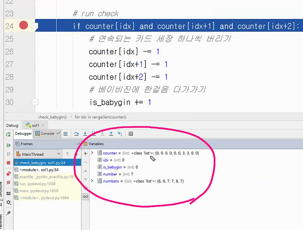

# Pycharm - Debug

### [디버깅 기초 참고 사이트](https://blog.naver.com/passion053/220745954177)

**알고리즘**을 풀며  **파이참**을 사용하는 이유 : **중간 과정을 알아보며 풀기 위해!**

### **Debug**

: 코드를 실행하다 내가 Debug설정한 곳에서 멈추게 된다.

**values**탭에 보면 어떤 것들이 들어가있는지 눈으로 볼 수 있다.

빨간색 24번 동그라미가 내가 **디버그를 사용한 부분**이다.

#### 🎂 debug시 필요한 파이참 버튼

**step over**(F8) : 중단점이 설정된 파일 안에서 중단점 이후의 코드를 한 줄 씩 실행시킨다.

**step into**(F7) : 프로젝트 전체에서 중단점 이후의 코드를 한 줄 씩 실행시킨다.

**step into my code** : 다음 중단점 까지 프로젝트 전체에서 내가 작성한 코드에 한해 중단점이 작동한다.

**step out** : 중단점 이후 실행되는 메서드로 이동

**run to cusor** : 현재 커서가 가리키고 있는 라인까지 이동한다. 커서를 사용해 드래그를한 뒤 커서를 클릭하면 해당 위치를 바로 다음에 디버거 시킬 수 있다. 그 사이 코드는 디버거 하지않고!

IndexOutOfRange 에러가 나온 상황에서 디버거 하는 것을 보여줄려고 함!

이렇게 드래그 해보면 어떤 값이 들어가있는지 알 수 있다.

#### 👀 번외

인풋이 00089 와 같이 들어갔을 때

인덱스가 9까지 밖에 없는데 인덱스 10을 접근해서 에러난 것임.

인덱스가 8이하일 때만 if문을 돌리면 된다.

#### 🐱‍🐉 참고 🐱‍🐉

SWEA에 제출을 눌러보면 몇 개는 틀렸다고 나오는 경우를 많이 보게 될 것임. 다시 말하자면, 문제에서 주어진 input을 사용하여  내가 작성한 알고리즘을 돌리면 문제에 주어진 output결과가 잘 나오는데도 불구하고, 채점을 돌려보면 한 두개 틀렸다는 말이 뜰 때가 있음. 

그 이유는 채점에서는 다른 input상황을 몇 가지 더 넣어 내가 작성한 알고리즘을 테스트 해보기 때문임. 그 몇 개 더 넣은 input값들은 SWEA가 일부러 넣은 것! 대부분의 사람들이 실수하는 부분에 있어서 특정 input값에 대해선 알고리즘이 돌아가지 않으니 해당 부분까지 완벽히 커버가능한 알고리즘을 작성했느냐를 테스트 하는 것임.

 결론적으로 내가 작성한 알고리즘이 다른 조건에서도 돌아가는지 보려고 일부러 까다로운 input값을 넣어 테스트 돌린 것이며 이걸 해결하는게 알고리즘 푸는 핵심이기도 함.

# SWEA

> SWEA - Learn - Course 에 들어가면 다음과 같은 화면을 볼 수 있다.
>
> 해당 사이트에 들어가보면 **강의**도 있고 **문제**들도 있다!

`IM`, `Advanced`, `Pro`는 **ssafy와 삼성 내부**에서 **SW역량테스트 등급**을 나눈 것이며

외부에서 Advanced가 A, A+!

 

외부에서 칭하는  A,B,C 등급이 가 조금 더 높은 수준이다.

회사 입사 시 가산점이 붙는 등급은  Advanced부터임.

SWEA에서 현재 우리가 푸는건 **D2** 이상 문제들 풀어나가는 중임

틈나는대로 **D1에 있는 문제들 쭉 다 보기.** 

**추천순**혹은 **정답률이 높은 순**으로 풀자!!

이번 3주동안의 알고리즘 집중 기간에는 IM을 목표로 하는 것이기 때문에 

2주 간은 뇌를 말랑말랑하게 만드는 기간이라 생각하고

남은 1주는 열심히 IM을 향해 공부하는 시간이라 생각하면 된다.

엄청나게 오래걸리는 시간을 가정하고 얼마만큼의 시간이 걸릴지 예측하는 것 빅오표기법

IM은 모든 요소들을 다 돌아다니며 특정 조건에 부합하는지를 물어볼 것임. 이게 바로 완전탐색!

## min max

방법 1. 해당 배열을 정렬 후 첫 번 째 요소와 마지막 요소를 고르면 됨. 그러나 정렬해나가는 과정 자체가 굉장히 오래 걸리는 방법임. n제곱승

방법 2. 애초에 앞에서 부터 뒤를 물어서 가자. 0번째 인덱스를 mix나 max로 ! 이게 가장 좋은 방법

가은님 풀이법 참고. for 안에 if두번 넣어서 하는게 더 효울적!

## 전기버스

방법 1. 내가 가려하는 k범위 안의 충전소 안에서 마지막 충전소 까지 저프하면 연료다쓰지않고 도차가능

방법 2. 일단 k만큼앞으로 보냄 그럼 최대로 가게되는데 그 이전에서 충전기가 있었느지 없었는지 확인 - 지용님 풀이

#### ✨ 참고 ✨

코드를 짤 때 변수이름은 문제에 주어지는 그대로 가져와 사용하자!

전기버스 문제를 예를들어 보면, K, N, M의 변수를 유지하자. count로 바꾸지 말고!

이렇게 변수를 적어주는 습관을 체화하자

#### 👌 TIP 👌

잘 못풀겠음 일단 이 문제를 어떻게 풀어야할지를 만말로풀어적어보자

IM수준은 말을 그대로 코드로 적으면 푸리는 문제들이다.

IM에선 그리디하게 푸는 것은 좋지 않음. 하나하나 확인해 나가는게 IM의 풀이방법

물론 나중에 A,A+형을 푼다면 다양한 알고리즘이 적용되어야 함. 그리디 알고리즘 같은 것.

IM은 모든 요소들을 다 돌아다니며 특정 조건에 부합하는지를 물어볼 것임. 이게 바로 완전탐색!

지금 우리가 해야할 것은 장인정신으로 한땀한땀 체크하며 전진하는 것이 목표

#### 🌹 참고 🌹

빅오표기법 : 엄청나게 오래걸리는 시간을 가정하고 얼마만큼의 시간이 걸릴지 예측하는 것 

완전탐색 : 모든 요소들을 다 돌아다니며 특정 조건에 부합하는지를 보는 것

---

파이썬과 루비는 거의 완전히 비슷한 언어

파이썬을 열심히 공부하다보면 자바 코드보면 대충 이해가 가능함

비슷한 객체지향 언어기떄문에

객체지향언어 사이들 프로그래밍 언어는 사투리 정도로 다른 것임!

중소기업, 스타트업은 다양한 언어를 맡는 경우가 많다.

---

### 🤳 학습 피라미드

가장 비효율적 공부방법이 수업듣기..가르치는게 가장 좋은 학습방법!

## 숫자카드 

스트링은 리터러블한 시퀀스 객채.

애초에 반복문 자체로도 사용할 수 있기 때문에 구지 스플릿 할 필요는 없다. 

가장 많이 사용하는 방법이 list(map(int,input())) 

웬만하면 이거 쓰는게 가장 편한 방법이다

list(map(int,input())) 뒤에 평소 습관처럼 스플릿 넣지 말기!

안에 띄워쓰기 가없어서 못쪼개기 때문에 input() 넣어 통으로 인티져로 바꿔준다. 

만약 1 2 3 4 5 이렇게 입력되있으면 split필요

## 구간합

